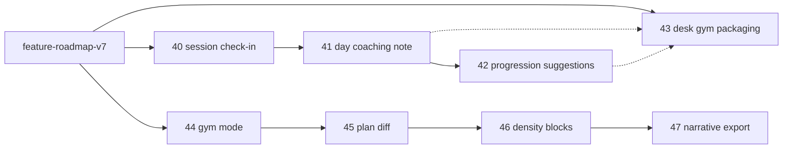
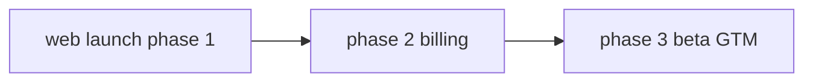
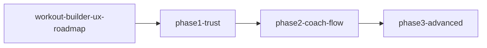
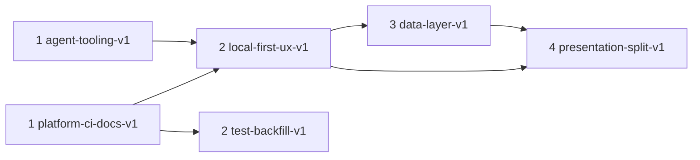

# PowerCoach Studio — Implementation Plans

Indice dei piani attivi per miglioramenti architetturali, tech debt, test e agent tooling.

## Identity roadmap v7 (attiva)

Claim: **Professional programming. Your data stays yours.**

Piano origine: [`identity_roadmap_v7_6595dc18.plan.md`](identity_roadmap_v7_6595dc18.plan.md)

| Onda | Plan | Feature | Stato |
|------|------|---------|-------|
| **Roadmap** | [feature-roadmap-v7](feature-roadmap-v7.plan.md) | Wave 1–3 | ✅ Wave 1–3 |
| **1 PR1** | [feature-40-session-checkin](feature-40-session-checkin.plan.md) | RPE/pain post-sessione | ✅ |
| **1 PR2** | [feature-41-day-coaching-note](feature-41-day-coaching-note.plan.md) | `Day.coachingNote` | ✅ |
| **1 PR3** | [feature-42-progression-suggestions](feature-42-progression-suggestions.plan.md) | Progressione suggest-only | ✅ |
| **1 PR4** | [feature-43-desk-gym-packaging](feature-43-desk-gym-packaging.plan.md) | Claim + desk→gym copy | ✅ |
| **2 PR1** | [feature-44-gym-mode](feature-44-gym-mode.plan.md) | Gym mode `/gym` | ✅ |
| **2 PR2** | [feature-45-plan-diff](feature-45-plan-diff.plan.md) | Plan diff A/B in-memory | ✅ |
| **3 PR1** | [feature-46-density-blocks](feature-46-density-blocks.plan.md) | Circuit / EMOM-lite | ✅ |
| **3 PR2** | [feature-47-progress-narrative-l10n](feature-47-progress-narrative-l10n.plan.md) | Narrative CSV IT/EN | ✅ |
| **Polish** | [feature-48-identity-polish](feature-48-identity-polish.plan.md) | Excel/Hevy/diff/gym density | ✅ |

**Ordine PR Wave 1:** 40 → 41 → 42; 43 in parallelo a 41/42 — ✅ completata.

**Wave 2:** [feature-44](feature-44-gym-mode.plan.md) → [feature-45](feature-45-plan-diff.plan.md) — ✅.

**Wave 3:** [feature-46](feature-46-density-blocks.plan.md) → [feature-47](feature-47-progress-narrative-l10n.plan.md) — ✅ su `feat/identity-wave3`.

**Post–Wave 3 polish:** [feature-48](feature-48-identity-polish.plan.md) — Excel density l10n, Hevy notes, plan-diff density, gym timer — branch `feat/identity-post-wave3-polish`.

---

## Workout builder UX (completata)

Analisi: [`docs/workout-builder-ux-analysis.md`](../docs/workout-builder-ux-analysis.md)

| Fase | Plan | Backlog ID |
|------|------|------------|
| **Roadmap** | [workout-builder-ux-roadmap](workout-builder-ux-roadmap.plan.md) | WB-01 … WB-22 |
| **1** | [workout-builder-ux-phase1-trust](workout-builder-ux-phase1-trust.plan.md) | WB-01 … WB-05 |
| **2** | [workout-builder-ux-phase2-coach-flow](workout-builder-ux-phase2-coach-flow.plan.md) | WB-06 … WB-12, WB-21 |
| **3** | [workout-builder-ux-phase3-advanced](workout-builder-ux-phase3-advanced.plan.md) | WB-13 … WB-22 |

### UI refresh / foglio sessione (completata)

| Plan | Stato |
|------|-------|
| [workout_builder_ui_refresh](workout_builder_ui_refresh_6cf046aa.plan.md) | ✅ card-based minimal |
| [session_sheet_builder_ui](session_sheet_builder_ui_eed9cec4.plan.md) | ✅ foglio sessione + toolbar |

## Persistenza local-first (completata su branch)

| Plan | Stato |
|------|-------|
| [local-first-persistence-v1](local-first-persistence-v1.plan.md) | ✅ Waves A–C su `feat/local-first-persistence` |

## Web launch

| Fase | Plan | Stato |
|------|------|-------|
| **1** | Trust/legal (#89) | ✅ |
| **2** | [web-launch-phase2-billing](web-launch-phase2-billing.plan.md) | ✅ |
| **3** | [web-launch-phase3-beta-launch](web-launch-phase3-beta-launch.plan.md) | ✅ mergiata |

---

## Plan attivi prodotto (workout builder UX) — storico dettaglio

| Fase | Plan | Backlog ID | PR stimati |
|------|------|------------|------------|
| **Roadmap** | [workout-builder-ux-roadmap](workout-builder-ux-roadmap.plan.md) | WB-01 … WB-22 | — |
| **1** | [workout-builder-ux-phase1-trust](workout-builder-ux-phase1-trust.plan.md) | WB-01 … WB-05 | 2–3 |
| **2** | [workout-builder-ux-phase2-coach-flow](workout-builder-ux-phase2-coach-flow.plan.md) | WB-06 … WB-12, WB-21 | 4–5 |
| **3** | [workout-builder-ux-phase3-advanced](workout-builder-ux-phase3-advanced.plan.md) | WB-13 … WB-22 | 5+ |

**Stato:** roadmap workout builder completata (PR #99–#103).

---

## Ordine di esecuzione consigliato

| Fase | Plan | Punti roadmap | PR stimati |
|------|------|---------------|------------|
| **1** | [platform-ci-docs-v1](platform-ci-docs-v1.plan.md) | 6, 9 | 3 |
| **1** | [agent-tooling-v1](agent-tooling-v1.plan.md) | 10, 11, 12, 13 | 3 |
| **2** | [local-first-ux-v1](local-first-ux-v1.plan.md) | 1(A), 5 | 4 |
| **2** | [test-backfill-v1](test-backfill-v1.plan.md) | 8 | 5–6 |
| **3** | [data-layer-v1](data-layer-v1.plan.md) | 3, 4 | 6 |
| **4** | [presentation-split-v1](presentation-split-v1.plan.md) | 2 | 5 |

## Mapping punti → plan

| # | Tema | Plan |
|---|------|------|
| 1 (A) | Rimuovere UX sync, backup come multi-device | local-first-ux-v1 |
| 2 | Spezzare mega-screen | presentation-split-v1 |
| 3 | God-object data layer | data-layer-v1 |
| 4 | Repository domain settings/auth | data-layer-v1 |
| 5 | Dead API (skipCache, l10n GymBlog) | local-first-ux-v1 |
| 6 | Pin Flutter CI/dev | platform-ci-docs-v1 |
| 8 | Test backfill | test-backfill-v1 |
| 9 | Doc cleanup | platform-ci-docs-v1 |
| 10 | Plan archive + AGENTS.md | agent-tooling-v1 |
| 11 | Hook cross-platform | agent-tooling-v1 |
| 12 | Regola anti-sync remoto | agent-tooling-v1 |
| 13 | Subagent routing | agent-tooling-v1 |

## Plan superseded / archived

Spostare in `archive/` (già fatto per i plan completati/superseded):

| Plan | Stato | Sostituito da |
|------|-------|---------------|
| `archive/feature-30-sync-strategy-v2.plan.md` | superseded | local-first-ux-v1 |
| `archive/local-only-auth-refactor_91727a50.plan.md` | completed | — |

I plan feature roadmap (`feature-01` … `feature-31`) restano come storico prodotto; non vanno rieseguiti se già completati.

## Come implementare un plan

1. Leggere il plan completo e i todo in frontmatter.
2. Sync `main` + creare branch (`feat/`, `refactor/`, `chore/`, `test/`, `docs/`).
3. Implementare un todo per PR quando possibile.
4. `flutter analyze` + `flutter test test/` prima del merge.
5. Aggiornare `status` dei todo nel plan (pending → completed).

Vedi anche `.cursor/rules/14-plan-implementation-branching.mdc`.
