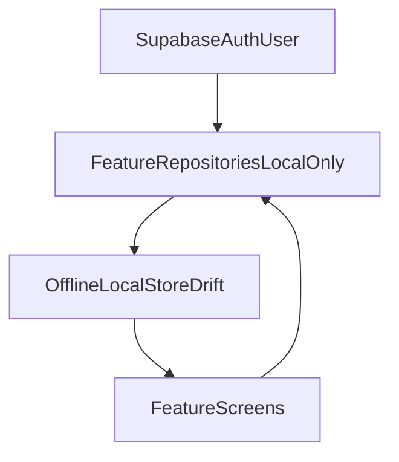

# Local-Only Auth Refactor Plan

## Target Outcome
- Keep only Supabase authentication/session checks.
- Remove all non-auth network calls (GymBlog API, sync replay, Supabase profiles/subscription CRUD).
- Persist business data locally, scoped by authenticated user id.

## Refactor Strategy

### 1) Remove Remote Plumbing from Bootstrap and DI
- Update startup flow in [D:/source/Gym/powercoach-studio/lib/main.dart](D:/source/Gym/powercoach-studio/lib/main.dart):
  - Remove `PersistentApiCache.restore(...)` and `SyncOrchestrator.initialize()/syncNow()` startup steps.
  - Keep dotenv + optional Sentry + Supabase auth initialization.
- Update [D:/source/Gym/powercoach-studio/lib/core/di/service_locator.dart](D:/source/Gym/powercoach-studio/lib/core/di/service_locator.dart):
  - Remove `GymBlogApiClient` registration.
  - Register local repositories/services needed by features.
- Deprecate/remove network layer files under `lib/core/network/` once call sites are migrated.

### 2) Replace Sync/Outbox with Pure Local Writes
- Refactor [D:/source/Gym/powercoach-studio/lib/core/sync/offline_repository_support.dart](D:/source/Gym/powercoach-studio/lib/core/sync/offline_repository_support.dart):
  - Stop enqueueing remote pending operations.
  - Keep optimistic local entity writes and versioning only.
- Retire [D:/source/Gym/powercoach-studio/lib/core/sync/sync_orchestrator.dart](D:/source/Gym/powercoach-studio/lib/core/sync/sync_orchestrator.dart) behavior:
  - Convert to no-op shim (temporary) or remove and update references.
- Remove sync UI dependencies from [D:/source/Gym/powercoach-studio/lib/widgets/sync_status_banner.dart](D:/source/Gym/powercoach-studio/lib/widgets/sync_status_banner.dart) and app shell usage.

### 3) Migrate Feature Repositories to Local Store
- Convert these repositories to local-only read/write paths (no API client calls):
  - [D:/source/Gym/powercoach-studio/lib/features/customers/data/customer_repository.dart](D:/source/Gym/powercoach-studio/lib/features/customers/data/customer_repository.dart)
  - [D:/source/Gym/powercoach-studio/lib/features/customers/data/customer_measurement_repository.dart](D:/source/Gym/powercoach-studio/lib/features/customers/data/customer_measurement_repository.dart)
  - [D:/source/Gym/powercoach-studio/lib/features/customers/data/customer_exercise_record_repository.dart](D:/source/Gym/powercoach-studio/lib/features/customers/data/customer_exercise_record_repository.dart)
  - [D:/source/Gym/powercoach-studio/lib/features/workouts/data/workout_plan_repository.dart](D:/source/Gym/powercoach-studio/lib/features/workouts/data/workout_plan_repository.dart)
  - [D:/source/Gym/powercoach-studio/lib/features/exercise_library/data/custom_exercise_repository.dart](D:/source/Gym/powercoach-studio/lib/features/exercise_library/data/custom_exercise_repository.dart)
- Remove direct API import/export usage from [D:/source/Gym/powercoach-studio/lib/features/exercise_library/presentation/screens/exercise_library_screen.dart](D:/source/Gym/powercoach-studio/lib/features/exercise_library/presentation/screens/exercise_library_screen.dart) or replace with local file-based import/export (if desired later).

### 4) Keep Auth, Remove Non-Auth Supabase Reads/Writes
- Preserve login/logout/session checks in router/auth screens.
- Refactor profile/subscription/settings screens to local persistence (or derived auth metadata only), removing Supabase table usage:
  - [D:/source/Gym/powercoach-studio/lib/features/auth/presentation/screens/profile_screen.dart](D:/source/Gym/powercoach-studio/lib/features/auth/presentation/screens/profile_screen.dart)
  - [D:/source/Gym/powercoach-studio/lib/features/settings/presentation/screens/personal_info_screen.dart](D:/source/Gym/powercoach-studio/lib/features/settings/presentation/screens/personal_info_screen.dart)
  - [D:/source/Gym/powercoach-studio/lib/features/settings/presentation/screens/subscription_screen.dart](D:/source/Gym/powercoach-studio/lib/features/settings/presentation/screens/subscription_screen.dart)
  - [D:/source/Gym/powercoach-studio/lib/features/settings/presentation/screens/settings_screen.dart](D:/source/Gym/powercoach-studio/lib/features/settings/presentation/screens/settings_screen.dart)

### 5) Remove "API Configured" Feature Gating
- Update screens that branch on `GymBlogApiClient.isConfigured` so local features are always enabled.
- Verify customer/workout/dashboard/exercise-library flows behave correctly without remote guards.

### 6) Cleanup + Verification
- Delete dead code and imports after migration (`GymBlogApiClient`, cache interceptors, sync triggers).
- Update tests including [D:/source/Gym/powercoach-studio/test/di/service_locator_test.dart](D:/source/Gym/powercoach-studio/test/di/service_locator_test.dart).
- Run:
  - `flutter analyze`
  - `flutter test test/`

## Data Flow (Post-Refactor)

## Risks and Mitigations
- Data assumptions may still rely on remote IDs/endpoints; mitigate by introducing local id/path adapters in repositories.
- Settings/profile UX currently tied to Supabase `profiles`; mitigate with explicit local profile model + migration defaults.
- Hidden sync references may remain in UI; mitigate with compile-time cleanup and global search for `SyncOrchestrator`, `GymBlogApiClient`, `/api/`.