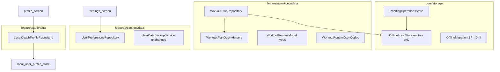

# Data Layer Architecture v1

## Punti coperti

| # roadmap | Descrizione |
|-----------|-------------|
| **3** | Ridurre god-object data layer |
| **4** | Uniformare domain/repository per feature |

## Obiettivo

Separare responsabilità senza cambiare schema Drift. Rendere settings/auth testabili come customers/workouts.

## Stato attuale

| File | Righe | Problema |
|------|-------|----------|
| `lib/core/storage/offline_local_store.dart` | 562 | Entity CRUD + SP migration + pending ops |
| `lib/features/workouts/data/workout_routine_model.dart` | 708 | Tipi + codec + helper |
| `lib/features/workouts/data/workout_plan_repository.dart` | ~586 | Query + lifecycle + session |
| `lib/core/storage/local_user_profile_store.dart` | 2239 | Usato direttamente da profile screen |
| Settings screens | — | SharedPreferences / backup service diretti |

## Architettura target



## Fase 1 — OfflineLocalStore split

### Nuovi file

```
lib/core/storage/
  offline_local_store.dart      # entity read/write, user scoping
  pending_operations_store.dart # enqueue, list, resolve, discard
  offline_migration.dart        # _legacyEntitiesKey migration one-shot
```

### Migration path

1. Creare `PendingOperationsStore` con stessa API pubblica usata oggi
2. `OfflineLocalStore` delega — nessun call site change in PR1
3. PR2 sposta migration SP in `offline_migration.dart`
4. PR3 aggiorna import nei repository

## Fase 2 — Workout routine model split

Esiste già:

- `test/features/workouts/workout_routine_json_codec_test.dart`
- `lib/features/workouts/data/workout_routine_mutations.dart` (pattern)

**Azione:** spostare metodi `fromJson`/`toJson`/plan encoding da `workout_routine_model.dart` nel codec file; model = classi + equality.

Target: `workout_routine_model.dart` < 300 righe.

## Fase 3 — WorkoutPlanRepository helpers

Estrarre metodi puri (filter, sort, map to UI model) in `workout_plan_query_helpers.dart` — già pattern simile in:

- `workout_plan_list_helpers.dart`
- `workout_template_list_helpers.dart`

## Fase 4 — Settings & auth repositories

### UserPreferencesRepository

```dart
// lib/features/settings/data/user_preferences_repository.dart
class UserPreferencesRepository {
  Future<AppLocale?> getLocale();
  Future<void> setLocale(AppLocale locale);
  // notifications toggle, etc.
}
```

Wrap: `AppLocaleController`, notification prefs stores — **no new dependencies**.

### LocalCoachProfileRepository

```dart
// lib/features/auth/data/local_coach_profile_repository.dart
class LocalCoachProfileRepository {
  Future<CoachProfile?> getProfile(String userId);
  Future<void> saveProfile(String userId, CoachProfile profile);
}
```

Wrap: `LocalUserProfileStore` — screen non importa store direttamente.

## Ordine PR

1. `refactor/extract-pending-ops-store`
2. `refactor/extract-offline-migration`
3. `refactor/split-workout-routine-codec`
4. `refactor/workout-plan-query-helpers`
5. `feat/settings-preferences-repository`
6. `feat/auth-local-profile-repository`

## Verifica

```bash
dart run build_runner build --delete-conflicting-outputs  # se tocchi Drift
flutter analyze
flutter test test/
flutter test test/local_only/
flutter test test/core/sync/
flutter test test/features/workouts/
```

## Rischi

- `OfflineLocalStore.instance` singleton — mantenere facade per non rompere 20+ call site in un PR
- Backup codec legge schema entity — coordinare con [`local-first-ux-v1`](local-first-ux-v1.plan.md) se si droppa PendingOperations

## Dipendenze

- Fase 1 pending ops: coordinare con [`local-first-ux-v1`](local-first-ux-v1.plan.md) (stop writes)
- Parallelo a [`presentation-split-v1`](presentation-split-v1.plan.md)
