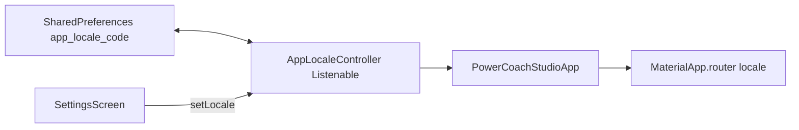

# Feature 01 — Lingua app end-to-end

## Obiettivo prodotto

- L’utente sceglie **Italiano** o **English** da Impostazioni.
- La scelta **persiste** tra riavvii e **si applica** a tutta l’app (`AppLocalizations`, formattazione date dove rilevante).
- Nessun `locale: const Locale('it')` fisso in [`lib/app.dart`](lib/app.dart) (oggi forza IT indipendentemente da sistema e preferenze).

## Stato attuale (riferimenti codice)

- [`lib/app.dart`](lib/app.dart): `MaterialApp.router` con `locale: const Locale('it')`, `supportedLocales` it/en, `localeResolutionCallback` con fallback `it`.
- [`lib/features/settings/presentation/screens/settings_screen.dart`](lib/features/settings/presentation/screens/settings_screen.dart): voce Lingua con `showNotImplementedAlert`.
- ARB: [`l10n/app_it.arb`](l10n/app_it.arb), [`l10n/app_en.arb`](l10n/app_en.arb) + codegen in [`lib/l10n/`](lib/l10n/).

## Architettura proposta

### Componente `AppLocaleController` (nome indicativo)

- **Responsabilità**: tenere `Locale` corrente (`Locale('it')` | `Locale('en')`), caricare da prefs all’avvio, salvare su cambio, notificare listener.
- **Posizione suggerita**: [`lib/core/locale/app_locale_controller.dart`](lib/core/locale/app_locale_controller.dart) (singleton o registrato in [`lib/core/di/service_locator.dart`](lib/core/di/service_locator.dart) se si vuole allineo DI).
- **API minima**: `Locale get locale`, `Future<void> load()`, `Future<void> setLocale(Locale)`, `void addListener` / `extends ChangeNotifier` o `ValueNotifier<Locale>`.

### Integrazione in `MaterialApp.router`

- Opzione A (minima): `PowerCoachStudioApp` diventa `StatefulWidget` che in `initState` chiama `load()` sul controller e `setState`/`ListenableBuilder` quando cambia locale.
- Opzione B: widget padre `ListenableBuilder(listenable: appLocale, builder: ...)` che wrappa solo `MaterialApp.router`.
- Impostare `locale: appLocale.locale` e lasciare `supportedLocales` / delegates come oggi.
- **`localeResolutionCallback`**: se l’utente ha scelto esplicitamente una lingua, la risoluzione deve rispettarla (non sovrascrivere con `it` di default quando `locale` è già impostato dall’app). Valutare rimozione del fallback rigido o uso di `localeListResolutionCallback` solo per **system** locale quando non c’è preferenza salvata.

### Bootstrap

- In [`lib/main.dart`](lib/main.dart) (dopo `WidgetsFlutterBinding.ensureInitialized`), opzionale: `await AppLocaleController.instance.load()` prima di `runApp` per evitare un frame con lingua sbagliata. In alternativa, primo frame con default `it` poi `load()` — trade-off semplicità vs flash linguistico.

### Impostazioni — UI

- Sostituire `onTap: showNotImplementedAlert` con:
  - **Bottom sheet** con due `RadioListTile` / `ListTile` selezionabili, oppure
  - **Push** a [`/settings/language`](lib/app.dart) (nuova route protetta) se si preferisce schermo dedicato.
- Alla selezione: `await controller.setLocale(...)` + eventuale `ScaffoldMessenger` “Lingua aggiornata”.
- Opzionale: mostrare lingua **sistema** come hint se diversa dalla scelta salvata (solo informativo).

### Date e numeri

- Cercare `DateFormat(` senza `locale:` in [`lib/features/dashboard/presentation/screens/coach_dashboard_screen.dart`](lib/features/dashboard/presentation/screens/coach_dashboard_screen.dart) e altri file: passare `AppLocalizations.of(context).localeName` o `Localizations.localeOf(context).toString()` a `DateFormat(..., locale)` per etichette coerenti con la lingua scelta.
- Verificare `intl` / `NumberFormat` se presenti.

## i18n

- Nuove chiavi ARB (esempi): `settingsLanguageTitle`, `settingsLanguageItalian`, `settingsLanguageEnglish`, `settingsLanguageSaved`.
- IT + EN in entrambi i file ARB; `flutter gen-l10n`.

## Test

- Widget test o unit test su `AppLocaleController`: default, persistenza round-trip prefs, `setLocale` notifica.
- Opzionale: golden test su una schermata con due locale (costoso da mantenere).

## Rischi e note

- **Web / Windows**: SharedPreferences ok; nessun cambio permessi.
- **GoRouter**: il cambio `locale` non richiede refresh del router; `MaterialApp` rebuild basta.
- **Coerenza backup**: se si esporta `settings_notifications_enabled`, valutare inclusione `app_locale_code` nel backup utente ([`lib/core/backup/user_data_backup_service.dart`](lib/core/backup/user_data_backup_service.dart)) in iterazione successiva.

## Definition of done

- Lingua modificabile da Impostazioni, persistente, nessun alert “non implementato”.
- `flutter analyze` pulito sui file toccati.
- Manuale: avvio app, cambio EN, navigazione dashboard + cliente, riavvio app → resta EN.
