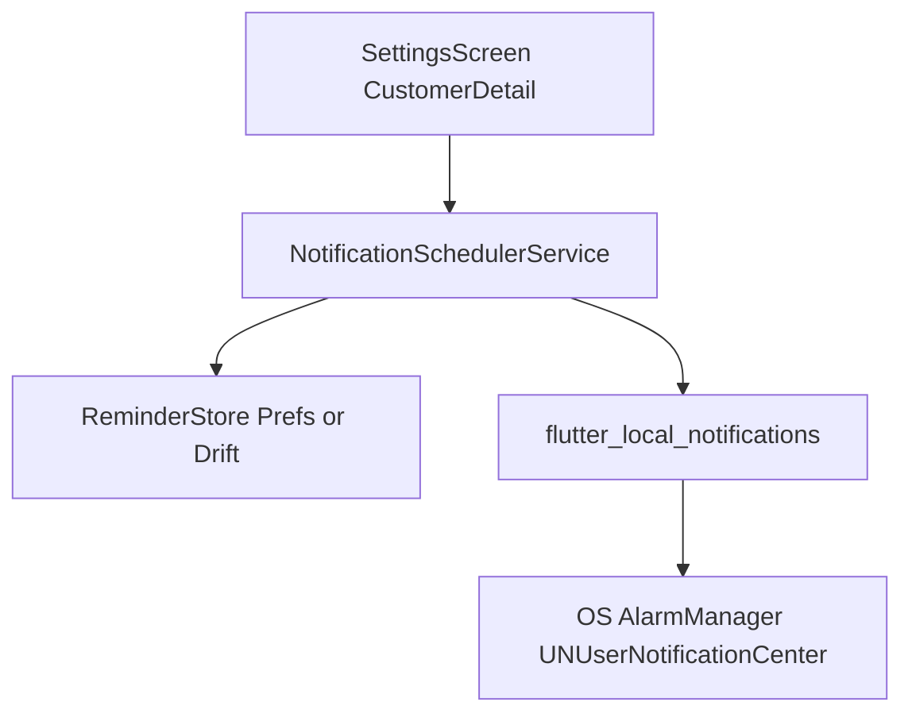

# Feature 02 — Promemoria e notifiche locali

## Obiettivo prodotto

- Il toggle **Notifiche** in [`lib/features/settings/presentation/screens/settings_screen.dart`](lib/features/settings/presentation/screens/settings_screen.dart) controlla realmente l’abilitazione alle **notifiche locali** (non solo prefs).
- Il coach può creare **promemoria** (es. “Sessione Mario — domani 09:00”) che generano una notifica all’orario scelto.

## Stato attuale

- Chiave prefs [`SettingsPrefsKeys.notificationsEnabled`](lib/core/settings/settings_prefs_keys.dart) già usata da settings e backup.
- Nessun plugin notifiche in [`pubspec.yaml`](pubspec.yaml) (da aggiungere — **nuova dipendenza**: richiede approvazione team se policy interna).

## Architettura proposta

### Dipendenze

- **`flutter_local_notifications`**: display + scheduling semplice.
- Opzionale **`timezone`**: per `zonedSchedule` corretto con DST.
- Valutare **`permission_handler`** solo se serve unificare permessi; su Android 13+ `POST_NOTIFICATIONS` va dichiarato e richiesto.

### `NotificationSchedulerService`

- **Init** (chiamata da `main` post-`runApp` o da primo accesso Impostazioni): inizializzare plugin, creare **canale Android** (importanza default), icone small/large in `android/app/src/main/res`.
- **requestPermission()**: iOS/macOS explicit; Android 13+ `requestNotificationsPermission` se esposto dalla versione del plugin.
- **scheduleReminder(Reminder r)**: `id` stabile int derivato da hash UUID (collisioni rare — documentare) o mappa locale id→int.
- **cancelReminder(id)** / **cancelAllForUser()** su logout se necessario.

### Modello dati `Reminder` (MVP)

- Campi minimi: `id` (uuid), `title`, `body`, `scheduledAt` (UTC), opzionale `customerId` per deep link.
- Persistenza MVP: **JSON in SharedPreferences** per velocità; se volume cresce → tabella Drift dedicata + migrazione schema.

### Collegamento Impostazioni

- `onChanged` dello switch:
  - Se `true`: `await requestPermission()`; se negato → `setState` revert + snackbar l10n.
  - Se `false`: `cancelAll()` (o solo promemoria futuri) + prefs false.
- All’avvio app: se prefs true ma permesso negato OS → mostrare banner soft o reset prefs (policy prodotto).

### Entry point creazione promemoria

- **Dashboard** o **Customer detail**: pulsante “Promemoria” → dialog `DatePicker` + `TimePicker` → salva in store → `scheduleReminder`.
- Payload notifica: route deep link es. `powercoach://customers/:id` — su Flutter usare `go_router` con `extra` limitato; su notifica tap usare `onDidReceiveNotificationResponse` per `context.go`.

## Piattaforme

| Piattaforma | Note |
|-------------|------|
| Android | Canale, icona, permesso 13+, exact alarm: valutare `SCHEDULE_EXACT_ALARM` (policy Play) — per MVP usare `inexact` scheduling se serve evitare permission sensitive |
| iOS | Capabilities Push non necessarie per local; richiesta alert permission |
| Web | Notifiche limitate; documentare “non supportato” e disabilitare switch o mostrare messaggio |
| Windows | Supporto plugin variabile; verificare README plugin |

## i18n

- Stringhe: permesso negato, promemoria salvato, errore scheduling, web non supportato.

## Test

- Unit test su serializzazione `Reminder` e mapping id.
- Mock del plugin dove possibile; altrimenti test manuali documentati.

## Rischi

- **Exact alarms** su Android e policy Play Store.
- **Logout**: cancellare notifiche pendenti legate all’utente o lasciare (preferibile cancellare per privacy su device condiviso).

## Definition of done

- Switch notifiche collegato a permesso reale e scheduling.
- Almeno un flusso UI crea un promemoria e la notifica appare (test device).
- `flutter analyze` ok; documentazione breve in `docs/` oppure commento in service.
