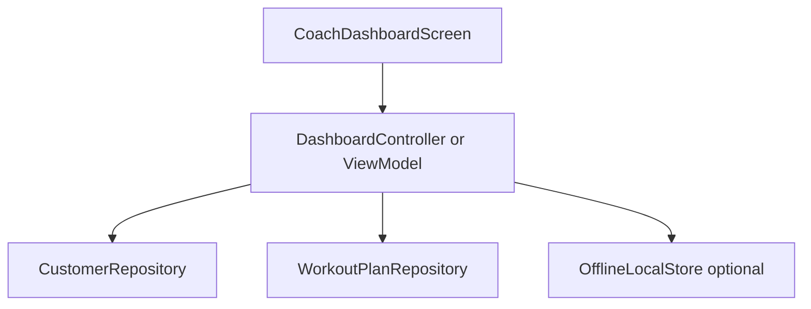

# Feature 03 — Dashboard “oggi” (command center)

## Obiettivo prodotto

- La home dopo login ([`/dashboard`](lib/app.dart) → [`CoachDashboardScreen`](lib/features/dashboard/presentation/screens/coach_dashboard_screen.dart)) risponde alla domanda: **“Cosa devo fare oggi?”** oltre a mostrare numeri riassuntivi.
- Ridurre attrito verso **clienti** e **piani** che richiedono attenzione.

## Stato attuale

- [`coach_dashboard_screen.dart`](lib/features/dashboard/presentation/screens/coach_dashboard_screen.dart): carica `CustomerRepository`, `WorkoutPlanRepository`; calcola conteggi, aggiornamenti settimanali, **today schedule** derivato da `planData` / data inizio piano (`_planStartDate`).
- Drawer e navigazione verso profilo, clienti, workout già presenti.

## Informazioni da surfacing (MVP realistico)

1. **Oggi (già parziale)**  
   - Mantenere/migliorare lista “programmi che iniziano oggi” con link profondo a editor piano o lista workout cliente (`/customers/:id/workouts`).

2. **Azioni / attenzione**  
   - Se il progetto usa ancora `PendingOperation` con status `failed` / `conflict`: lista sintetica da [`OfflineLocalStore.instance.readPendingOperations()`](lib/core/storage/offline_local_store.dart) filtrata per utente corrente.  
   - Se stack è **local-only** senza outbox: sostituire con “Dati solo locali — backup consigliato” + link a Impostazioni backup.

3. **Clienti senza piano attivo**  
   - Clienti con zero `WorkoutPlanRepository.getByCustomerId` o ultimo piano `deleted`/archiviato (definire regola).

4. **Piani “fermi”**  
   - Piani con `updatedAt` oltre soglia (config cost `kStalePlanDays`).

5. **Collegamenti rapidi**  
   - FAB o chip: Nuovo cliente, Nuovo programma (navigate a route esistenti).

## Architettura

- **Separazione logica**: spostare calcoli da `State` a classe testabile `DashboardSnapshotLoader` che restituisce `DashboardSnapshot` immutabile (clientCount, todayItems, stalePlans, pendingIssues, customersWithoutPlan).
- **Refresh**: mantenere `RefreshIndicator`; opzionale ascolto stream auth (già `SupabaseBootstrap.refreshTick` sul router).

## UI / UX

- Sezioni verticali con titoli chiari (l10n).
- Empty state amichevole per ogni sezione (non solo testo grigio).
- Limiti: max 5 righe per sezione + “Vedi tutti” → route dedicata futura o scroll espanso.

## Navigazione profonda

- Tap su voce oggi → `context.push('/customers/${id}/workouts')` o editor con `planId` se disponibile nella lista.
- Tap su pending conflict → schermata risoluzione se esiste; altrimenti TODO documentato.

## i18n

- Chiavi: `dashboardSectionToday`, `dashboardSectionAttention`, `dashboardNoPending`, `dashboardStalePlans`, `dashboardCustomersNoPlan`, `dashboardSeeAll` (se usato).

## Test

- `DashboardSnapshotLoader` test con dati finti (liste vuote, mix stati).
- Widget smoke: presenza sezioni quando snapshot non vuoto.

## Rischi

- **Performance**: `getAll()` clienti + tutti i piani può crescere; valutare caching in-memory per sessione o lazy load sezioni.
- **Accuratezza “oggi”**: dipende da parsing `planData`; documentare limiti (MVP).

## Definition of done

- Almeno **3 sezioni** nuove o rafforzate (Oggi + 2 tra attenzione/stale/senza piano).
- Nessuna regressione su refresh e drawer.
- `flutter analyze` + test nuovi verdi.
