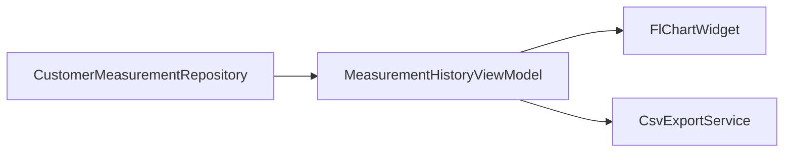

# Feature 05 — Storico e confronto misurazioni

## Obiettivo prodotto

- Nel percorso **Cliente → Misurazioni** il coach vede un **grafico** dell’andamento nel tempo per le metriche principali (es. peso, massa grassa se presente).
- Opzionale MVP+: **export CSV** (e PDF tabellare se a basso costo) per condividere con il cliente.

## Stato attuale

- [`CustomerMeasurementRepository`](lib/features/customers/data/customer_measurement_repository.dart): CRUD su `OfflineEntityType.measurement` scoped per `customerId`.
- UI misurazioni probabilmente in [`customer_detail_screen.dart`](lib/features/customers/presentation/screens/customer_detail_screen.dart) (da verificare durante implementazione per punto di innesto).

## Scoperta tecnica (da fare all’inizio dello sprint)

1. Aprire [`lib/features/customers/data/models/customer_measurement.dart`](lib/features/customers/data/models/customer_measurement.dart) e documentare **campi numerici** e **date** disponibili nel payload.
2. Elencare quali metriche mostrare nel MVP (max 3–5 per evitare UI affollata).

## Libreria grafici

| Opzione | Note |
|---------|------|
| `fl_chart` | Molto usata, theming Material friendly |
| `syncfusion_flutter_charts` | Potente ma licenza/commerciale da valutare |

**Raccomandazione**: `fl_chart` (MIT) salvo vincoli aziendali.

## UX — Schermata storico

- **Selettore metrica**: `SegmentedButton` o `DropdownButton` (peso, vita, etc.).
- **Grafico linea** (`LineChart`) con asse X date localizzate (`DateFormat` con locale da Feature 01 quando disponibile).
- **Marker** ultima misura + tooltip tap (valore + data).
- **Empty state**: illustrazione testuale “Aggiungi una misurazione”.
- **Confronto periodi** (se incluso nello stesso sprint): toggle “Ultimo mese vs mese precedente” con due serie colori diversi o card riepilogo `% delta`.

## Export CSV

- Intestazione colonne = nomi campi normalizzati.
- Usare `ListToCsvConverter` manuale o `csv` package (nuova dipendenza — valutare implementazione manuale con virgole escaped per ridurre deps).
- Condivisione: `Share.share` o `Share.shareXFiles` con file temp in [`path_provider`](pubspec.yaml) cache dir.

## Export PDF (opzionale)

- Riutilizzare pattern [`pdf`](pubspec.yaml) come export workout se esiste helper; altrimenti posticipare a v2.

## Architettura

- `MeasurementHistoryViewModel`: prende `List<CustomerMeasurement>`, produce `List<FlSpot>` per metrica selezionata, gestisce `loading/error`.

## Performance

- Ordinare misurazioni una volta O(n log n); downsampling se n > 200 (media mobile opzionale).

## i18n

- `measurementHistoryTitle`, `measurementMetricWeight`, `measurementExportCsv`, errori share.

## Test

- ViewModel: lista non ordinata → punti ordinati; valori nulli ignorati.
- Golden opzionale per chart (fragile).

## Rischi

- **Campi eterogenei** se le misurazioni sono free-form: serve mapping noto chiave→etichetta o fallback “campo personalizzato”.
- **Locale date** su asse X allineato a Feature 01.

## Definition of done

- Grafico navigabile per almeno una metrica principale + export CSV funzionante.
- Empty/error/loading coperti.
- `flutter analyze` pulito.
