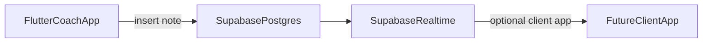

# Feature 08 — Note / thread condiviso con il cliente (fase coach)

## Obiettivo prodotto (MVP)

- Per ogni **cliente** esiste un **thread** di messaggi testuali ordinati per data, visibile al coach nell’app.
- Il coach aggiunge note rapidamente (follow-up, infortunio, preferenze).
- Dati **offline-first** coerenti con [`OfflineLocalStore`](lib/core/storage/offline_local_store.dart) / `OfflineRepositorySupport`.

## Non-obiettivi MVP (espliciti)

- **Cliente finale** che legge l’app: non incluso salvo login cliente separato (fuori scope).
- **Notifiche push** al cliente quando arriva una nota: posticipare (dipende da Feature 02 + backend).
- **Allegati immagine**: fase 2 (storage path + dimensioni + permessi galleria).

## Stato attuale

- Nessun tipo `OfflineEntityType` per note in [`lib/core/sync/offline_models.dart`](lib/core/sync/offline_models.dart) — richiede **estensione enum** + rigenerazione/adattamento dove si fa `switch` exhaustive (verificare con analyzer).

## Scelta architetturale storage

### Opzione A — Una `OfflineEntity` per messaggio

- `OfflineEntityType.customerNote` (o `customerMessage`).
- `scopeId = customerId`, `id = messageUuid`, `payload` = `{ body, createdAt, authorUserId, readAt? }`.
- **Pro**: riusa outbox/sync path esistente; backup già copre `LocalEntities`.
- **Contro**: molte righe per thread molto lungo; serve paginazione `readEntities` con `limit` (estendere store se manca).

### Opzione B — Un’entità thread unica JSON

- Una row per `customerId` con `payload.messages[]`.
- **Pro**: lettura atomica thread.
- **Contro**: conflitti merge su scritture concorrenti; file JSON grande.

**Raccomandazione MVP**: **Opzione A** con paginazione (ultimi N messaggi) e indicizzazione `updatedAt`.

## Repository

Nuovo file suggerito: [`lib/features/customers/data/customer_notes_repository.dart`](lib/features/customers/data/customer_notes_repository.dart)

- `Future<List<ClientNoteMessage>> listNotes(String customerId, {int limit = 50})`
- `Future<void> addNote(String customerId, String body)`
- Opzionale `Stream<List<...>> watchNotes` via polling timer o Drift stream se si introduce tabella Drift dedicata invece di entity generica.

## UI

- Schermata chat: `ListView.builder` con `reverse: true` o anchor bottom; `TextField` + `IconButton` send.
- Validazione: body non vuoto, max length (es. 4000).
- **Badge** non letti: campo `readAt` lato coach opzionale; MVP tutti “letti” al focus schermata.

## Navigazione

- [`lib/app.dart`](lib/app.dart): sotto `/customers/:id` aggiungere child route `notes`.
- [`CustomerDetailScreen`](lib/features/customers/presentation/screens/customer_detail_screen.dart): voce di menu.

## Backup

- Se si usa `OfflineEntityType` nuovo, le note finiscono in export [`UserDataBackupService`](lib/core/backup/user_data_backup_service.dart) automaticamente con le altre entità **solo se** `listEntitiesJsonForBackup` include tutti i tipi (oggi per userId — sì).
- Aggiornare [`.cursor/rules/13-user-data-backup-json-compat.mdc`](.cursor/rules/13-user-data-backup-json-compat.mdc) se cambia semantica payload.

## Fase 2 — Sync / “condivisione” reale

- Tabella `customer_notes` con RLS: `coach_id = auth.uid()` OR `customer_profile_id` match.
- Realtime channel per `customer_id`.
- **Non implementare** nel MVP salvo requisito esplicito; preparare solo interfacce repository `abstract class CustomerNotesRemoteSync`.

## Sicurezza e privacy

- Note possono contenere **dati sanitari**: avviso in UI prima primo invio; evitare log Sentry con body testo.
- Logout: dati restano cifrati solo se device encryption — almeno `wipeForUser` già su logout cancella store locale.

## i18n

- `customerNotesTitle`, `customerNotesHint`, `customerNotesEmpty`, `customerNotesSend`, errori rete (fase 2).

## Test

- Repository: dopo `addNote`, `listNotes` contiene messaggio con `authorUserId` corrente.
- Widget: tap send con testo → lista aggiornata.

## Rischi

- **Enum exhaustive**: ogni `switch (OfflineEntityType)` nel codebase va aggiornato.
- **Volume**: paginazione obbligatoria prima di ship su clienti longevi.

## Definition of done

- Thread note per cliente funzionante offline, navigabile, persistente dopo riavvio.
- Export backup include nuove righe (verifica manuale import/export round-trip).
- `flutter analyze` + test base verdi.
