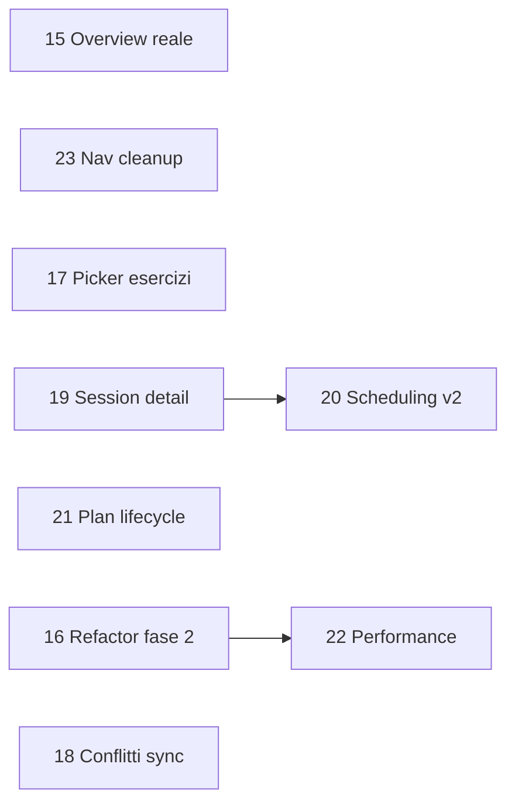

# Roadmap v3 — Coach workflow, affidabilità e qualità builder

## Scope

Coordina **9 feature** richieste, mappate su **9 piani** in `.cursor/plans/`.

| # | Feature | Piano | Priorità | Dipendenze |
|---|---------|-------|----------|------------|
| 1 | Overview cliente con metriche reali | [feature-15](feature-15-customer-overview-real-metrics.plan.md) | Alta | misure già implementate |
| 2 | Refactor builder fase 2 | [feature-16](feature-16-builder-refactor-phase2.plan.md) | Alta | consigliato dopo feature-14 (mergiata) |
| 3 | Picker esercizi da coach | [feature-17](feature-17-exercise-picker-ux.plan.md) | Alta | exercise library esistente |
| 4 | Risoluzione conflitti sync | [feature-18](feature-18-sync-conflict-resolution.plan.md) | Media-alta | outbox esistente |
| 5 | Session detail reale | [feature-19](feature-19-session-detail-real.plan.md) | Media | feature-12 (mergiata) |
| 7 | Scheduling v2 — override sessione | [feature-20](feature-20-scheduling-v2-session-overrides.plan.md) | Media | feature-11/12 |
| 8 | Ciclo di vita piano | [feature-21](feature-21-plan-lifecycle.plan.md) | Media | filtri lista già parziali |
| 9 | Performance builder + web | [feature-22](feature-22-builder-performance.plan.md) | Media | ideale dopo feature-16 |
| 10A | Nascondere nav placeholder | [feature-23](feature-23-builder-nav-cleanup.plan.md) | Bassa | nessuna |

## Ordine consigliato (4 wave + reliability)

### Wave A — Quick wins (1 PR ciascuno)
- **15**: card overview da misure reali + trend 30gg
- **23**: rimuovere voci Library/Diary/Stats dalla bottom nav standalone

### Wave B — Coach workflow (2–3 PR)
- **17**: recenti, pin, sheet picker unificato
- **19**: `ScheduleDetailScreen` da `PlanCalendarEvent` reale
- **21**: archivia/termina piano + badge stato (oltre filtri euristici esistenti)

### Wave C — Calendario avanzato (1–2 PR)
- **20**: `sessionOverrides` in planData + UI sposta/salta data

### Wave D — Qualità builder (1–2 PR)
- **16**: estrazione mobility tab + dialoghi + controller
- **22**: lazy tab, debounce dirty, rebuild mirati

### Wave E — Affidabilità offline (1 PR)
- **18**: schermata risoluzione conflitto keep-local / accept-remote

## Stato attuale rilevante (giu 2026 — roadmap completata)

- Overview: metriche reali da `customer_overview_metrics.dart` + trend 30gg
- Builder: `workout_builder_mobility_screen.dart` ~1500 righe; estratti controller, tab, mutazioni dominio
- Picker: `exercise_add_sheet` fullscreen con recenti/pin; mobility registra recenti
- Sync: `SyncIssuesScreen` con keep/accept/retry/discard (locale; replay remoto deferito)
- Schedule detail: `SessionDetailLoader` + route reali
- Scheduling v2: `sessionOverrides` in planData + UI sposta/salta
- Lifecycle: `archivedAt`/`completedAt`, badge, CTA completa in tab Dettagli builder
- Bottom nav: Builder / Templates / Profile (no placeholder)

### Deferito post-roadmap

- Replay sync remoto quando `SyncOrchestrator` tornerà in produzione
- Profiling DevTools manuale su piani stress (documentazione PR)

## Stato storico pre-implementazione (riferimento)
- Misure: [`MeasurementPeriodCompare`](lib/features/customers/domain/measurement_period_compare.dart), [`measurement_history_chart.dart`](lib/features/customers/presentation/widgets/measurement_history_chart.dart) — riusabili
- Builder: [`workout_builder_mobility_screen.dart`](lib/features/workouts/presentation/screens/workout_builder_mobility_screen.dart) ~4300 righe; estratti solo `workout_plan_details_tab`, `workout_export_sheet`
- Picker: autocomplete inline in builder; nessun recent/favorite
- Sync: [`_showPendingDetail`](lib/features/dashboard/presentation/screens/coach_dashboard_screen.dart) — dialog read-only, nessuna risoluzione
- Schedule detail: [`schedule_detail_screen.dart`](lib/features/dashboard/presentation/screens/schedule_detail_screen.dart) — query mock
- Scheduling v1: [`planSessionDate`](lib/features/dashboard/domain/plan_calendar_event.dart) + `scheduledWeekday`
- Filtri piano: [`WorkoutPlanFilter`](lib/features/workouts/domain/workout_plan_list_helpers.dart) — euristici, no `archivedAt` persistito
- Bottom nav: [`_WorkoutBuilderBottomNav`](lib/features/workouts/presentation/screens/workout_builder_mobility_screen.dart) — 3 route placeholder

## Policy implementazione

- Ogni piano approvato → branch da `main` (`feat/<scope>-<desc>` o `fix/...`).
- `flutter analyze` + test mirati per ogni PR.
- i18n IT/EN obbligatorio per UI nuova.

## Definition of done (roadmap completa)

- Tutti i 9 piani figlio mergiati o esplicitamente deferiti con issue.
- Nessuna regressione su export PDF/JSON, calendario coach, routing web workout.
- Overview cliente senza dati mock; builder senza link a schermate "In arrivo" in nav standalone.
