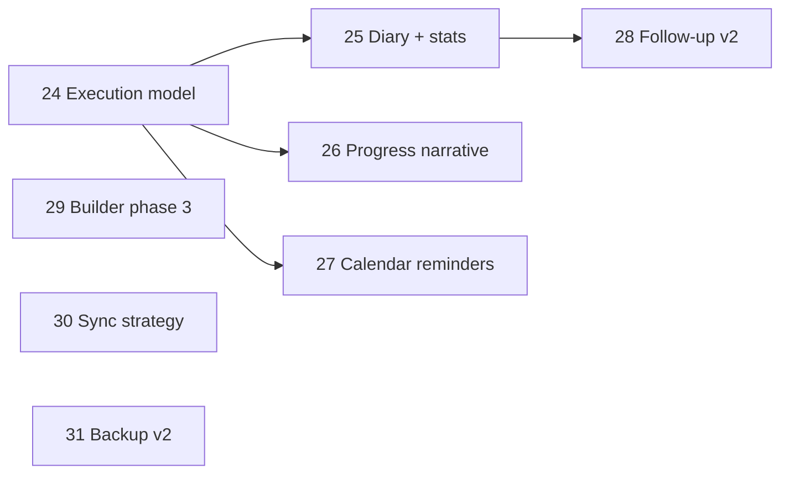

# Roadmap v4 — Esecuzione, aderenza e intelligence coach

## Tesi

La v3 ha reso **affidabili** i flussi coach (builder, calendario, lifecycle, sync locale).  
La v4 sposta il focus su **cosa succede dopo l’assegnazione**: esecuzione sessioni, aderenza, analytics e narrativa di progresso nel tempo.

## Scope

Coordina **8 feature**, mappate su **8 piani** in `.cursor/plans/`.

| # | Feature | Piano | Priorità | Dipendenze |
|---|---------|-------|----------|------------|
| 1 | Modello esecuzione sessione | [feature-24](feature-24-session-execution-model.plan.md) | Alta | v3 session status |
| 2 | Diario workout + coach stats | [feature-25](feature-25-workout-diary-coach-stats.plan.md) | Alta | feature-24 |
| 3 | Progress narrative cliente | [feature-26](feature-26-customer-progress-narrative.plan.md) | Alta | feature-24 |
| 4 | Reminder da calendario | [feature-27](feature-27-calendar-linked-reminders.plan.md) | Media | feature-02 (notifiche) |
| 5 | Follow-up da esecuzione | [feature-28](feature-28-follow-up-from-execution.plan.md) | Media | feature-24, follow-up esistente |
| 6 | Builder refactor fase 3 | [feature-29](feature-29-builder-refactor-phase3.plan.md) | Media | feature-16 (v3) |
| 7 | Strategia sync v2 | [feature-30](feature-30-sync-strategy-v2.plan.md) | Media-bassa | feature-18, SyncReplayHook |
| 8 | Backup / restore v2 | [feature-31](feature-31-backup-restore-v2.plan.md) | Bassa-media | backup v1 |

## Ordine consigliato (5 wave)

### Wave A — Fondazione dati (1 PR)
- **24**: modello `SessionExecution` in planData o entità locale; collegamento a `sessionCompletionByKey`

### Wave B — Valore coach visibile (2 PR paralleli)
- **25**: schermata diario reale (sostituisce redirect `/workouts/diary`); dashboard stats coach
- **26**: pannello progresso unificato nel customer detail (misure + aderenza + PR)

### Wave C — Automazione workflow (1–2 PR)
- **27**: promemoria auto da sessioni pianificate (`NotificationSchedulerService`)
- **28**: follow-up che eredita volumi/load da esecuzioni precedenti

### Wave D — Maturità piattaforma (1–3 PR, parziale)
- **29**: estrazione superset/prescription dal builder; target <1000 righe screen
- **30**: decisione esplicita local-only vs SyncOrchestrator; semplificazione UX di conseguenza
- **31**: restore selettivo, validazione envelope, test compatibilità

## Stato attuale rilevante (post-v4, giu 2026)

| Area | Stato |
|------|--------|
| Session execution | `sessionExecutions` in planData + `SessionExecutionService` |
| Session status | `PlanSessionStatusService` sincronizza flag e log |
| Diary / Stats | `WorkoutDiaryScreen`, `CoachStatsScreen` (route reali) |
| Session log | `session_log_sheet` da schedule detail |
| Progress cliente | `CustomerProgressPanel` (aderenza, PR, strip 4 settimane) |
| Reminder calendario | `CalendarReminderScheduler` + toggle Settings; reschedule on resume/archive |
| Follow-up | `applyExecutedLoads` da esecuzioni precedenti |
| Builder fase 3 | `workout_superset_actions.dart` estratto; screen ~1510 righe (target 1000 deferito) |
| Sync | Local-first (`docs/sync-strategy.md`); coda dati locale |
| Backup v2 | Preview import, merge by id, conferma IMPORT per replace |

### Deferito post-v4

- Builder screen sotto 1000 righe e `WorkoutSupersetPanel` UI dedicata (F29 parziale)
- Grafico settimanale in coach stats (KPI numerici presenti)
- Cloud sync / `SyncOrchestrator` (decisione: local-first)

## Decisione prodotto obbligatoria (Wave D)

Prima di implementare **30**, il team deve scegliere:

1. **Local-first excellence** — diario e stats tutti offline; sync UI ridotta a backup/export  
2. **Cloud comeback** — ripristinare `SyncOrchestrator` + replay remoto multi-device  

La v4 **non blocca** le wave A–C su questa scelta.

## Policy implementazione

- Ogni piano approvato → branch da `main` (`feat/<scope>-<desc>`).
- `flutter analyze` + test mirati per ogni PR.
- i18n IT/EN obbligatorio per UI nuova.
- Nessun nuovo placeholder "In arrivo": diary e stats devono essere schermate reali o route rimosse.

## Definition of done (roadmap completa)

- Coach vede aderenza per cliente e globale (non solo flag completed).
- Esiste diario sessioni con storico navigabile.
- Customer detail racconta progresso nel tempo (misure + aderenza + record esercizi).
- Reminder opzionali legati al calendario sessioni.
- Decisione sync documentata e UX allineata.
- Tutti i 8 piani figlio mergiati o deferiti con issue esplicita.

## Roadmap successiva

Residui v4 (grafici stats, diario dettaglio, backup selettivo, superset panel, export progresso) sono pianificati in **[feature-roadmap-v5.plan.md](feature-roadmap-v5.plan.md)** (feature-32 … feature-38).

## Riferimenti

- Roadmap precedente: [feature-roadmap-v3.plan.md](feature-roadmap-v3.plan.md)
- Roadmap successiva: [feature-roadmap-v5.plan.md](feature-roadmap-v5.plan.md)
- Gap analysis (obsoleta, archiviata): [`docs/archive/FEATURE_GAP_ANALYSIS.md`](../../docs/archive/FEATURE_GAP_ANALYSIS.md)
