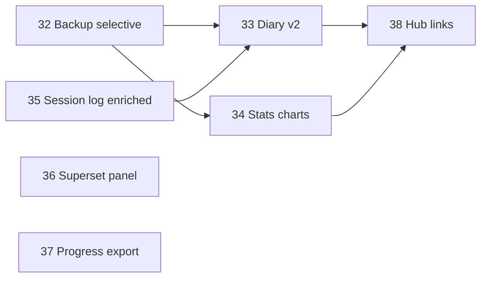

# Roadmap v5 — Profondità coach e polish piattaforma

## Tesi

La **v4** ha introdotto il modello dati di esecuzione (session log, aderenza, progress panel, reminder, follow-up da load reali).  
La **v5** rende queste capability **più utilizzabili ogni giorno**: dettaglio navigabile, grafici, backup controllato, log sessione completo, superset builder dedicato, export progresso cliente.

Non riapre sync cloud (decisione local-first in [`docs/sync-strategy.md`](../../docs/sync-strategy.md)).

## Scope

Coordina **7 feature**, mappate su **7 piani** in `.cursor/plans/`.

| # | Feature | Piano | Priorità | Dipendenze |
|---|---------|-------|----------|------------|
| 1 | Backup selettivo + metadata | [feature-32](feature-32-backup-selective-restore.plan.md) | Alta | backup v1/v2 parziale (F31) |
| 2 | Diario workout v2 | [feature-33](feature-33-workout-diary-v2.plan.md) | Alta | F24, diary MVP |
| 3 | Coach stats — grafici | [feature-34](feature-34-coach-stats-charts.plan.md) | Media-alta | F25, CoachStatsLoader |
| 4 | Session log arricchito | [feature-35](feature-35-session-log-enriched.plan.md) | Media-alta | F24, session_log_sheet |
| 5 | Builder superset panel | [feature-36](feature-36-builder-superset-panel.plan.md) | Media | F29 parziale, workout_superset_actions |
| 6 | Export progresso cliente | [feature-37](feature-37-customer-progress-export.plan.md) | Media-bassa | F26, CustomerProgressPanel |
| 7 | Coach hub discoverability | [feature-38](feature-38-coach-hub-discoverability.plan.md) | Bassa | F33, F34 |

## Ordine consigliato (6 wave)

### Wave A — Multi-device sicuro (1 PR)
- **32**: restore selettivo per gruppi entità + metadata envelope (`exportedAt`, `entityCounts`)

### Wave B — Intelligence visibile (2 PR paralleli)
- **33**: schermata dettaglio diario, filtri data/stato, deep link a piano/sessione
- **34**: grafico aderenza/settimana in coach stats; opzionale export CSV KPI

### Wave C — Log sessione completo (1 PR)
- **35**: edit set/reps/load in `session_log_sheet`; allineamento diary ↔ schedule detail

### Wave D — Builder UX (1 PR)
- **36**: pannello superset dedicato; prescription scope coerente con training tab

### Wave E — Portabilità progresso (1 PR)
- **37**: export PDF/CSV riepilogo progresso cliente (aderenza + PR + misure)

### Wave F — Discoverability (1 PR, quick win)
- **38**: link dashboard → diario/stats; entry coerenti da customer detail e schedule

## Stato attuale rilevante (post-v4 + presentation-split, lug 2026)

| Area | Stato MVP | Gap v5 |
|------|-----------|--------|
| Backup import | Preview counts + merge/replace + conferma IMPORT | No restore selettivo per gruppo; metadata envelope limitato |
| Workout diary | Lista + filtro cliente + bottom sheet dettaglio | No filtro data/stato; no route dettaglio; no link a piano |
| Coach stats | KPI 7/30gg numerici | Nessun grafico; no export |
| Session log | Checklist esercizi da schedule detail | No edit set/load; diary non apre stesso dettaglio |
| Builder superset | `workout_superset_actions.dart` | UI multiset non dedicata; flow disperso |
| Progress cliente | `CustomerProgressPanel` in overview | No export/share per coach |
| Navigazione | Route `/workouts/diary`, `/workouts/stats` reali | Poche entry da dashboard / hub |

## Cosa NON è in v5

- Sync cloud / `SyncOrchestrator` (archiviato — local-first)
- Presentation-split ulteriore (v1–v5 chiusi; file ≤470 righe)
- Hevy bidirezionale / API remote coach data
- Refactor data layer massivo

## Policy implementazione

- Piano approvato → branch da `main` (`feat/<scope>-<desc>`).
- `flutter analyze --no-pub` + test mirati per ogni PR.
- i18n IT/EN obbligatorio per UI nuova.
- Aggiornare todo del piano figlio a `completed` al merge del PR.
- Dopo v5: aggiornare stati obsoleti nei piani v4 figlio (F24–F31) con nota "implementato in v4/v5".

## Definition of done (roadmap completa)

- Import backup con scelta gruppi entità (almeno clienti / piani / library).
- Diario con dettaglio full-screen e filtri data.
- Coach stats con almeno un grafico temporale.
- Session log permette set/load opzionali oltre alla checklist.
- Superset gestibile da pannello dedicato nel builder training.
- Export progresso cliente (PDF o CSV) da customer detail.
- Dashboard o hub con accesso evidente a diario e stats.
- Tutti i 7 piani figlio mergiati o deferiti con motivazione esplicita.

## Riferimenti

- Roadmap precedente: [feature-roadmap-v4.plan.md](feature-roadmap-v4.plan.md)
- Sync: [`docs/sync-strategy.md`](../../docs/sync-strategy.md)
- Backup compat: [`.cursor/rules/13-user-data-backup-json-compat.mdc`](../rules/13-user-data-backup-json-compat.mdc)
- Presentation split chiuso: [presentation-split-v5.plan.md](presentation-split-v5.plan.md)
