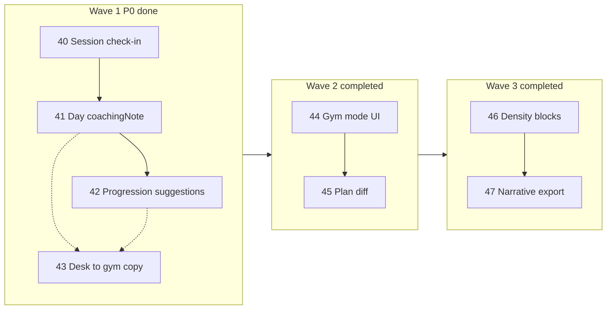

# Roadmap v7 — Professional programming + your data

## Claim prodotto

> **Professional programming. Your data stays yours.**  
> Programmazione da professionista. I tuoi dati restano tuoi.

Anti-positioning: *not a fitness CRM* — meno chat/pagamenti, più scheda, progressione, log, ownership dati local-first.

Piano dettagliato origine: [`identity_roadmap_v7_6595dc18.plan.md`](identity_roadmap_v7_6595dc18.plan.md).

## Scope per onda

| Onda | Focus | Feature | PR tipici | Stato |
|------|--------|---------|-----------|-------|
| **1** | Identità quotidiana | Check-in sessione; `Day.coachingNote`; progression suggestions; packaging claim | 3–4 | ✅ |
| **2** | Sala + mestiere | Gym mode dedicato; plan version diff/compare | 2–3 | ✅ |
| **3** | Densità + narrative | Circuit/EMOM-lite; polish narrative export multi-lingua | 2 | ✅ |

Fuori roadmap v7: sync live, app atleta, CRM messaggi/pagamenti, AI black-box.

## Wave 1 — piani figlio ✅

Ordine PR consigliato: **40 → 41 → 42**, **43 in parallelo** a 41/42.

| # | Feature | Piano | Branch |
|---|---------|-------|--------|
| 40 | Post-session check-in (RPE + pain) | [feature-40](feature-40-session-checkin.plan.md) | `feat/identity-wave1-session-checkin` |
| 41 | Day coaching notes | [feature-41](feature-41-day-coaching-note.plan.md) | `feat/identity-wave1-day-coaching-note` |
| 42 | Progression suggestions (rules-based) | [feature-42](feature-42-progression-suggestions.plan.md) | `feat/identity-wave1-progression-suggestions` |
| 43 | Desk→gym / claim packaging | [feature-43](feature-43-desk-gym-packaging.plan.md) | `feat/identity-wave1-desk-gym-copy` |

### Definition of done Wave 1 ✅

- Coach salva RPE/pain nel log; li rivede in diario
- Ogni giorno di scheda ha una nota coaching opzionale, preservata in follow-up/PDF dove applicabile
- Suggerimenti progressione visibili e applicabili one-tap senza mutare silenziosamente il piano
- Landing/settings comunicano claim + flusso desk→gym via backup/snapshot
- `flutter analyze` + test workouts/backup/dashboard rilevanti
- Nessuna migration Drift; solo additive `planData` JSON

## Wave 2 — piani figlio ✅

Ordine PR: **44 → 45**. Branch: `feat/identity-wave2`.

| # | Feature | Piano | Branch |
|---|---------|-------|--------|
| 44 | Gym mode — session runner full-screen | [feature-44](feature-44-gym-mode.plan.md) | `feat/identity-wave2` |
| 45 | Plan diff — confronto strutturale A/B | [feature-45](feature-45-plan-diff.plan.md) | `feat/identity-wave2` |

### Definition of done Wave 2 ✅

- Coach apre `/gym` e vede sessioni di oggi con tap grandi; avvia log sessione riusando `session_log_sheet` / `SessionExecutionService`
- Coach confronta due versioni piano dello stesso cliente in-memory (picker A/B) senza migration Drift
- `flutter analyze` + test routing/gym screen + diff domain
- Nessuna nuova tabella Drift; diff e picker solo in memoria

## Wave 3 — piani figlio ✅

Ordine PR: **46 → 47**. Branch: `feat/identity-wave3`.

| # | Feature | Piano | Branch |
|---|---------|-------|--------|
| 46 | Circuit / EMOM-lite density blocks | [feature-46](feature-46-density-blocks.plan.md) | `feat/identity-wave3` |
| 47 | Progress narrative export IT/EN | [feature-47](feature-47-progress-narrative-l10n.plan.md) | `feat/identity-wave3` |

### Definition of done Wave 3 ✅

- Coach crea circuit/EMOM nel builder; PDF/Excel mostrano label tipo + meta; `Day.densityBlocks` additive in planData
- Export progresso CSV include narrative locale (IT/EN) sopra sezione machine
- `flutter analyze` + test density/codec + progress export
- Nessuna migration Drift

## Gap vs claim (post Wave 3)

| Pezzo | Stato |
|-------|--------|
| PDF professionale, superset, session log, progress export | Esiste |
| Local-first + backup/cloud snapshot + reminder | Esiste |
| Note esercizio/set | Esiste |
| Note **giorno**, RPE/pain strutturati, progressione suggerita, desk→gym copy | ✅ Wave 1 |
| Gym mode dedicato, plan version diff | ✅ Wave 2 |
| Circuit/EMOM-lite, narrative export multi-lingua | ✅ Wave 3 |

## Rischi cross-Wave 1 (chiusi)

- Parse carico libero (`"100kg"`, `"@8"`) → suggestion graceful (testo se non numerico)
- Collisione semantica RPE piano vs sessione → naming + l10n chiari
- Over-messaging backup → una FAQ + sottotitolo settings, non tre banner nuovi

## Rischi cross-Wave 2

- Duplicazione logica session log sheet vs gym runner → estrarre orchestrator condiviso, non fork persistenza
- Diff troppo verboso su piani grandi → raggruppare per day/exercise; nascondere set identici
- Route `/gym` su web → full-screen senza shell sidebar; `parentNavigatorKey: appRootNavigatorKey`
