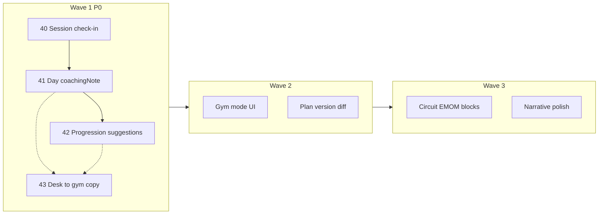

# Roadmap v7 — Professional programming + your data

## Claim prodotto

> **Professional programming. Your data stays yours.**  
> Programmazione da professionista. I tuoi dati restano tuoi.

Anti-positioning: *not a fitness CRM* — meno chat/pagamenti, più scheda, progressione, log, ownership dati local-first.

Piano dettagliato origine: [`identity_roadmap_v7_6595dc18.plan.md`](identity_roadmap_v7_6595dc18.plan.md).

## Scope per onda

| Onda | Focus | Feature | PR tipici |
|------|--------|---------|-----------|
| **1** | Identità quotidiana | Check-in sessione; `Day.coachingNote`; progression suggestions; packaging claim | 3–4 |
| **2** | Sala + mestiere | Gym mode dedicato; plan version diff/compare | 2–3 |
| **3** | Densità + narrative | Circuit/EMOM-lite; polish narrative export multi-lingua | 2 |

Fuori roadmap v7: sync live, app atleta, CRM messaggi/pagamenti, AI black-box.

## Wave 1 — piani figlio

Ordine PR consigliato: **40 → 41 → 42**, **43 in parallelo** a 41/42.

| # | Feature | Piano | Branch suggerito |
|---|---------|-------|------------------|
| 40 | Post-session check-in (RPE + pain) | [feature-40](feature-40-session-checkin.plan.md) | `feat/identity-wave1-session-checkin` |
| 41 | Day coaching notes | [feature-41](feature-41-day-coaching-note.plan.md) | `feat/identity-wave1-day-coaching-note` |
| 42 | Progression suggestions (rules-based) | [feature-42](feature-42-progression-suggestions.plan.md) | `feat/identity-wave1-progression-suggestions` |
| 43 | Desk→gym / claim packaging | [feature-43](feature-43-desk-gym-packaging.plan.md) | `feat/identity-wave1-desk-gym-copy` |

### Definition of done Wave 1

- Coach salva RPE/pain nel log; li rivede in diario
- Ogni giorno di scheda ha una nota coaching opzionale, preservata in follow-up/PDF dove applicabile
- Suggerimenti progressione visibili e applicabili one-tap senza mutare silenziosamente il piano
- Landing/settings comunicano claim + flusso desk→gym via backup/snapshot
- `flutter analyze` + test workouts/backup/dashboard rilevanti
- Nessuna migration Drift; solo additive `planData` JSON

## Wave 2 — indice (non implementare in Wave 1)

| Tema | Descrizione |
|------|-------------|
| **Gym mode** | UI sala dedicata (tap grandi, sessione del giorno, offline-first) — estende session sheet |
| **Plan diff** | Confronto due snapshot routine / versioni piano |

## Wave 3 — indice (non implementare in Wave 1)

| Tema | Descrizione |
|------|-------------|
| **Density** | Circuit / EMOM-lite oltre superset |
| **Narrative** | Raffinare export progresso multi-lingua |

## Gap vs claim (stato oggi)

| Pezzo | Stato |
|-------|--------|
| PDF professionale, superset, session log, progress export | Esiste |
| Local-first + backup/cloud snapshot + reminder | Esiste |
| Note esercizio/set | Esiste |
| Note **giorno**, RPE/pain strutturati, progressione suggerita, desk→gym copy | Mancano / thin |

## Rischi cross-Wave 1

- Parse carico libero (`"100kg"`, `"@8"`) → suggestion graceful (testo se non numerico)
- Collisione semantica RPE piano vs sessione → naming + l10n chiari
- Over-messaging backup → una FAQ + sottotitolo settings, non tre banner nuovi
