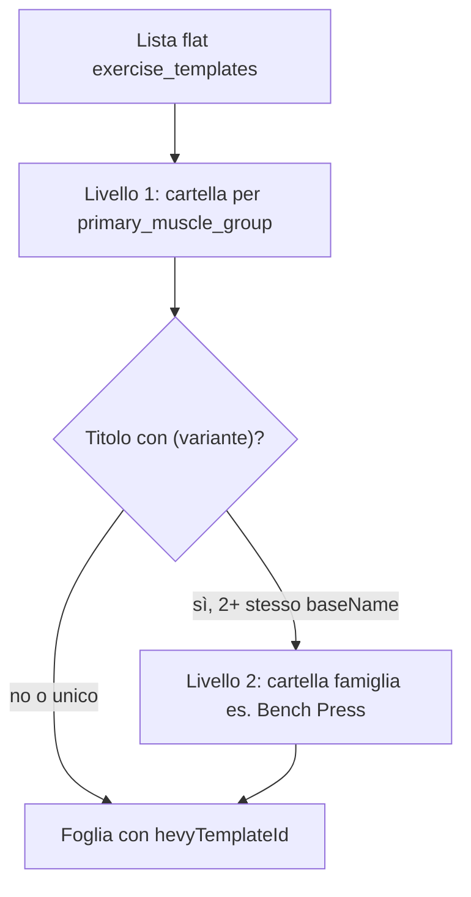
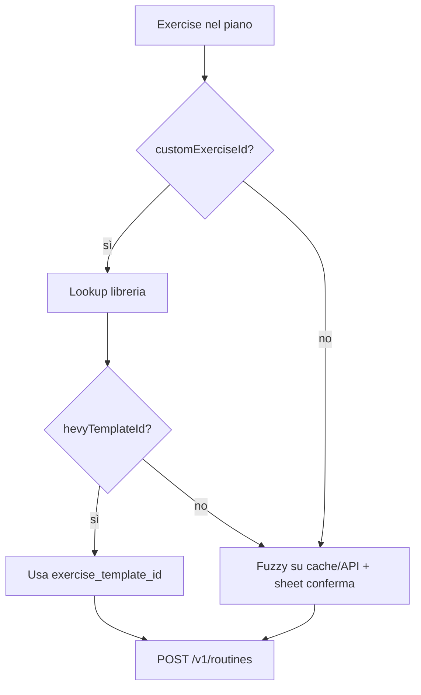

# Integrazione export workout → Hevy (account coach)

## Contesto prodotto

PowerCoach Studio è **coach-centric**: i piani vivono in [`WorkoutRoutine`](lib/features/workouts/data/workout_routine_model.dart) (`Week` → `Day` → `Exercise`) dentro `planData` di [`WorkoutPlanApiModel`](lib/features/workouts/data/workout_plan_api_model.dart). Le sessioni calendario sono già modellate con [`PlanCalendarEvent`](lib/features/dashboard/domain/plan_calendar_event.dart) (`planId`, `weekIndex`, `dayIndex`, `sessionKey`).

**Scelta confermata:** l’export usa l’**account Hevy del coach** (API key unica in app). Non è (per ora) export verso l’Hevy del cliente.

Esistono già export locali PDF/Excel ([`export_pdf_usecase.dart`](lib/features/workouts/domain/export_pdf_usecase.dart), [`export_excel_usecase.dart`](lib/features/workouts/domain/export_excel_usecase.dart)) — Hevy segue lo stesso pattern “use case + sheet di conferma”.

---

## Valutazione proposta: catalogo Hevy in libreria esercizi

### Stato attuale

In [`exercise_library_screen.dart`](lib/features/exercise_library/presentation/screens/exercise_library_screen.dart) l’import offre già:

1. **Set predefinito PowerCoach** — [`default_exercise_catalog.dart`](lib/features/exercise_library/data/default_exercise_catalog.dart) (nomi IT, famiglie/varianti, senza ID Hevy)
2. **File JSON custom**

Nel workout builder, gli esercizi possono collegarsi alla libreria via [`Exercise.customExerciseId`](lib/features/workouts/data/workout_routine_model.dart).

### Proposta utente (evoluta)

1. **Seconda lista** = catalogo Hevy con **`hevyTemplateId` pre-mappato** su ogni foglia.
2. **Import completo** di tutti gli esercizi restituiti da Hevy (non sottoinsieme on demand).
3. **Struttura gerarchica** dove possibile, come il set predefinito PowerCoach (cartelle → varianti).

### Giudizio

| Aspetto | Valutazione |
|--------|-------------|
| Allineamento UX | **Forte** — riusa il pattern `_importDefaultCatalog` / `_importItems` già collaudato |
| Qualità mapping | **Forte** — elimina fuzzy match per la maggior parte dei piani costruiti da libreria Hevy |
| Manutenzione | **Medio** — serve snapshot versionato + refresh opzionale da API |
| Complessità dati | **Bassa** — un campo opzionale `hevyTemplateId` sul payload `customExercise` |
| Rischio sync GymBlog | **Da verificare** — campo extra deve restare locale o essere ignorato dal backend (non rompere sync) |

**Raccomandazione:** adottare il catalogo Hevy pre-mappato come **strategia primaria** di mapping; ridurre fuzzy match + sheet manuale al solo caso esercizi scritti a mano senza `customExerciseId` o senza `hevyTemplateId`.

### Cosa non fare

- Non sostituire il catalogo IT PowerCoach: restano **due set distinti** (separati per `catalogSource`).
- Non pretendere che Hevy fornisca gerarchia nativa: l’albero è **costruito in PowerCoach** dai metadati flat (`primary_muscle_group`, parsing titolo).
- Non assumere ID built-in identici su tutti gli account senza spike; gli esercizi `is_custom` sono **per account** e vanno inclusi nel full import con API key del coach.

---

## API Hevy — cosa è disponibile

Documentazione ufficiale: [api.hevyapp.com/docs](https://api.hevyapp.com/docs)

| Aspetto | Dettaglio |
|--------|-----------|
| Accesso | Solo **Hevy Pro**; API key da [hevy.com/settings?developer](https://hevy.com/settings?developer) |
| Stabilità | API sperimentale (“use at your own risk”, struttura può cambiare) |
| Auth | Header `api-key` su richieste REST |
| Catalogo esercizi | `GET /v1/exercise_templates` (paginato) + `POST /v1/exercise_templates` per custom |
| Creazione contenuto | `POST /v1/routines` e `POST /v1/workouts` |

### Routine vs Workout (raccomandazione)

- **`POST /v1/routines`**: routine in “My Routines” — adatta a sessione **pianificata**.
- **`POST /v1/workouts`**: richiede `start_time` / `end_time` — solo se si vuole loggare sessione già fatta.

**MVP:** export come **Routine** con titolo `{programName} · {dayName} · W{n} D{m}`.

---

## Catalogo Hevy: import completo + gerarchia

### Vincolo API Hevy

`GET /v1/exercise_templates` restituisce un elenco **piatto** per template (`id`, `title`, `primary_muscle_group`, `type`, `is_custom`, …). **Non esiste parent/child lato Hevy.** La gerarchia in PowerCoach va **derivata** (come già fa [`default_exercise_catalog.dart`](lib/features/exercise_library/data/default_exercise_catalog.dart) con `addFamily`).

### Regole di costruzione gerarchia (`HevyCatalogHierarchyBuilder`)

Nuovo componente in `lib/features/integrations/hevy/domain/hevy_catalog_hierarchy_builder.dart`:



| Livello | Tipo nodo | `hevyTemplateId` | `parentId` | Esempio |
|--------|-----------|------------------|------------|---------|
| 1 | Cartella muscolo | `null` | `null` | `hevy_grp_chest` → "Petto" |
| 2 | Cartella famiglia (opzionale) | `null` | muscolo | `hevy_fam_bench_press` → "Bench Press" |
| 3 | Foglia esercizio | **ID Hevy** | muscolo o famiglia | `D04AC939` → "Bench Press (Barbell)" |

**Livello 1 — `primary_muscle_group`**

- Una cartella root per ogni valore distinto (label localizzata IT/EN in l10n).
- Fallback: `other` se assente; sottocartella **Custom** per `is_custom: true` se non classificabile.

**Livello 2 — parsing titolo** (dove possibile)

- Regex: titolo `Base (Variante)` → `baseName` + `variant`.
- Se **≥ 2** template condividono lo stesso `baseName` nello stesso muscolo → creare cartella famiglia (stesso pattern di `addFamily` nel catalogo IT).
- Se una sola occorrenza o titolo senza parentesi → foglia **diretta** sotto il muscolo (nessun livello 2).

**Mobility / cardio**

- Se `type` indica durata/cardio (da validare nello spike): `isMobility: true` e/o cartella dedicata sotto muscolo `cardio`, così le tab Standard/Mobility restano coerenti.

**Ordinamento**

- Cartelle: `sortOrder` per muscolo (ordine anatomico configurabile).
- Foglie: alfabetico per `title` dentro la famiglia.

### Import completo (requisito utente)

| Aspetto | Comportamento |
|--------|----------------|
| Scope | **Tutte** le pagine di `GET /v1/exercise_templates` (built-in + custom dell’account coach) |
| Trigger | (1) Dopo salvataggio API key in Settings — dialog “Importa tutti gli esercizi Hevy?”; (2) voce import libreria “Sincronizza catalogo Hevy completo”; (3) refresh manuale in Settings |
| Scrittura | Batch in transazione offline; barra di progresso (`N/M`) |
| Idempotenza | **Upsert** per `hevyTemplateId`: se esiste già voce con stesso ID → update nome/parent; altrimenti create |
| Cartelle sintetiche | ID stabili prefissati `hevy_grp_*`, `hevy_fam_*` (non esportabili verso Hevy) |
| Duplicati import | Non re-importare famiglie duplicate; secondo sync aggiorna solo delta |

Estendere [`_importItems`](lib/features/exercise_library/presentation/screens/exercise_library_screen.dart) oppure nuovo `HevyCatalogImportService` che:

1. Chiama API (o legge asset pre-generato offline).
2. Esegue `HevyCatalogHierarchyBuilder.build(flatList)`.
3. Importa **prima le cartelle** (roots → famiglie), poi le **foglie** con `hevyTemplateId` — stesso ordine topologico già usato per `parentId` in `_importItems`.

### Asset JSON (fallback offline)

File opzionale [`hevy_exercise_catalog_v1.json`](lib/features/integrations/hevy/assets/hevy_exercise_catalog_v1.json) con **stessa struttura gerarchica** (`parentId` già risolti) per:

- test senza rete;
- primo avvio prima della key (solo built-in snapshot, senza custom account).

Import **primario** resta da **API live** (include custom del coach). Asset rigenerato da script dev a ogni release.

### UX libreria esercizi

| Elemento | Comportamento |
|----------|----------------|
| **Tab “Hevy”** (terza tab) | Mostra solo nodi `catalogSource == hevy` nell’albero gerarchico; ricerca/filter sulla lista piatta |
| Import sheet | Voce **“Importa / sincronizza tutti gli esercizi Hevy”** (sostituisce import parziale) |
| Nodi cartella | Non selezionabili nel picker builder (solo foglie con `hevyTemplateId`) |
| Set PowerCoach IT | Tab Standard/Mobility invariati; nessuna mescolanza visiva con Hevy |

### Modello dati libreria

Estendere [`CustomExerciseItem`](lib/features/exercise_library/data/custom_exercise_item.dart):

```dart
final String? hevyTemplateId;   // solo foglie esercizio
final String catalogSource;     // 'powercoach' | 'hevy' | 'manual'
final bool isHevyFolder;        // true = cartella sintetica (no export)
```

`CustomExerciseRepository.create` / import: propagare i campi sopra; spike su sync GymBlog (ignorare campi extra lato server).

**Picker builder:** tab o filtro “Libreria Hevy”; solo foglie; badge Hevy su selezione.

---

## Strategia mapping esercizi (rivista)

Priorità al momento dell’export:



### 1. Primario — libreria Hevy completa con `hevyTemplateId`

- Coach esegue **full import/sync** una volta (o dopo ogni refresh catalogo).
- Nel builder sceglie foglie dall’albero Hevy → `customExerciseId` → `hevyTemplateId`.
- Export: **O(1)** per ogni esercizio collegato alla libreria Hevy.

### 2. Secondario — mapping manuale persistente (solo gap)

Per esercizi PowerCoach IT o free-text senza `hevyTemplateId`:

```
HevyExerciseMapping
  powercoachKey   // customExerciseId o hash(normalizedName)
  hevyTemplateId
  updatedAt
```

Sheet export mostra solo righe **unmapped** (molto più piccolo del flusso originale).

### 3. Terziario — fuzzy suggest

Solo in sheet unmapped: exact/fuzzy su catalogo Hevy (asset + cache API). Soglia alta; mai auto-export senza conferma.

### 4. Fallback

| Caso | Comportamento |
|------|----------------|
| Senza `hevyTemplateId` | Blocca export o sheet obbligatorio |
| Mobility non in catalogo Hevy | Escludi con warning o `POST` custom su Hevy |
| Superset | MVP: sequenza lineare |

---

## Gap dati: prescrizioni e campi

| PowerCoach | Hevy |
|------------|------|
| `sets` / `reps` / `rpe` stringhe | `reps` int, `weight_kg`, `rpe` enum |
| `setDetails[]` con `line` | Parser dedicato (come export PDF) |

Invariato rispetto al piano precedente — il catalogo Hevy **non** risolve le prescrizioni, solo gli ID esercizio.

---

## Architettura Flutter proposta

```
lib/features/integrations/hevy/
  assets/hevy_exercise_catalog_v1.json   # snapshot gerarchico opzionale
  data/
    hevy_api_client.dart
    hevy_catalog_import_service.dart     # full fetch + upsert libreria
    hevy_exercise_mapping_repository.dart  # solo fallback manuale
  domain/
    hevy_catalog_hierarchy_builder.dart
    hevy_exercise_resolver.dart
    hevy_export_day_usecase.dart
    hevy_prescription_parser.dart
    hevy_routine_mapper.dart
  presentation/
    hevy_settings_section.dart
    hevy_export_review_sheet.dart   # solo unmapped

lib/features/exercise_library/
  data/default_exercise_catalog.dart     # invariato (PowerCoach IT)
  data/hevy_exercise_catalog_import.dart # buildImportJson() da asset
  presentation/...                       # terza voce import + badge Hevy
```

**Secrets:** API key in `flutter_secure_storage`. Catalogo asset in repo **non** contiene segreti.

**Backup utente:** documentare se `hevyTemplateId` su `customExercise` entra nel backup JSON; preferibile sì (utile al restore).

---

## UX — punti di ingresso export

1. **Workout builder** — menu Export → “Esporta giornata su Hevy”
2. **Calendario coach** — azione su `PlanCalendarEvent`
3. **Settings** — API key, test, aggiorna catalogo Hevy da API

Flusso export:

1. API key presente
2. Resolver: tutti gli esercizi del giorno hanno `hevyTemplateId` (via libreria o mapping salvato)?
3. Se no → sheet **solo unmapped** (link a libreria Hevy o pick manuale)
4. `POST /v1/routines` → successo

---

## Fasi di delivery (aggiornate)

### Fase 0 — Spike

- API: templates + POST routine
- Script: genera `hevy_exercise_catalog_v1.json`
- Verificare stabilità ID built-in vs custom per account

### Fase 1 — Full import + gerarchia (prima dell’export)

- `HevyApiClient` + paginazione templates
- `HevyCatalogHierarchyBuilder` + test unit (muscolo, famiglia, foglia singola)
- `HevyCatalogImportService` — import **tutti** gli esercizi, progress UI, upsert
- Tab “Hevy” in libreria + modello `catalogSource` / `isHevyFolder`
- Prompt post-config API key; asset JSON opzionale offline

### Fase 2 — Export MVP

- `HevyExerciseResolver` + `HevyExportDayUseCase` + parser prescrizioni
- Export routine da builder; sheet solo unmapped
- Test unit resolver + parser

### Fase 3 — Calendario + hardening

- Export da calendario
- Refresh catalogo da API
- Mapping manuale persistente per edge case
- i18n IT/EN

### Fuori scope

- Export su account Hevy del cliente
- Sync bidirezionale Hevy ↔ PowerCoach
- Sostituzione del catalogo IT predefinito con quello Hevy

---

## Rischi e mitigazioni

| Rischio | Mitigazione |
|---------|-------------|
| ID Hevy cambiano / API instabile | `catalogVersion` in asset; adapter isolato; refresh opzionale |
| Libreria grande (~400+ foglie + cartelle) | Lista espandibile + ricerca; import in batch; tab Hevy dedicata |
| Esercizi piano solo testo IT | Fuzzy + sheet; invito a usare catalogo Hevy in builder |
| Campo `hevyTemplateId` e sync GymBlog | Spike: campo ignorato dal server o `localOnly` metadata |
| Nomi EN vs piani IT | Due cataloghi paralleli; coach sceglie fonte in fase di costruzione piano |

---

## Definition of done (MVP)

- Coach può **importare/sincronizzare tutti** gli esercizi Hevy in libreria, visualizzati in **albero gerarchico** (muscolo → famiglia → foglia)
- Ogni foglia ha `hevyTemplateId`; cartelle non esportabili
- Esercizi del piano collegati alla libreria Hevy esportano senza mapping manuale
- Export giornata → routine Hevy; unmapped gestiti in sheet ridotto
- `flutter analyze` + test su resolver e parser
- Doc: come rigenerare asset catalogo + requisito Hevy Pro
