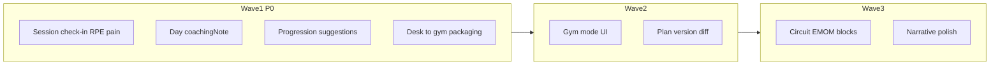

# Roadmap v7 — Professional programming + your data

Decisioni chiuse: **roadmap + dettaglio Wave 1**; Wave 1 = check-in RPE/pain + note giorno + progressione da log + packaging desk→gym (niente gym mode / plan diff).

Claim prodotto (IT/EN, non Italian-as-identity):

> **Professional programming. Your data stays yours.**  
> Programmazione da professionista. I tuoi dati restano tuoi.

Anti-positioning marketing: *not a fitness CRM* — meno chat/pagamenti, più scheda, progressione, log, ownership.

All’avvio implementazione: aggiungere [`.cursor/plans/feature-roadmap-v7.plan.md`](.cursor/plans/feature-roadmap-v7.plan.md) + piani figlio Wave 1, e indice in [`.cursor/plans/README.md`](.cursor/plans/README.md). Branch da `main`: `feat/identity-wave1-*` (uno per PR logica).

---

## Stato oggi (gap vs claim)

| Pezzo | Stato |
|-------|--------|
| PDF professionale, superset, session log, progress export | Esiste |
| Local-first + backup/cloud snapshot + reminder | Esiste |
| Note esercizio/set | Esiste |
| Note **giorno**, RPE/pain strutturati, progressione suggerita, desk→gym copy | Mancano / thin |

---

## Roadmap v7 — onde

| Onda | Focus | Feature | PR tipici |
|------|--------|---------|-----------|
| **1** | Identità quotidiana | Check-in sessione; `Day.coachingNote`; progression suggestions; packaging claim | 3–4 |
| **2** | Sala + mestiere | Gym mode dedicato; plan version diff/compare | 2–3 |
| **3** | Densità + narrative | Circuit/EMOM-lite; polish narrative export multi-lingua | 2 |

Fuori roadmap v7: sync live, app atleta, CRM messaggi/pagamenti, AI black-box.

---

## Wave 1 — dettaglio implementabile

Ordine PR consigliato (indipendenze): **C → B → A**, **D in parallelo** a B/A.

### PR1 — Post-session check-in (RPE + pain)

Estendere [`session_execution.dart`](lib/features/workouts/domain/session_execution.dart) (campi opzionali, JSON additive):

- `sessionRpe` (`int?` 1–10) — difficoltà **sessione reale** (nome distinto da `ExerciseSet.rpe` prescrittivo)
- `painLevel` (`int?` 0–10)
- `painLocation` (`String?` opzionale)

UI in [`session_log_sheet.dart`](lib/features/workouts/presentation/…) dopo lista esercizi, prima delle note libere; opzionale su skip. Diario: mostrare in entry body.

Test: codec round-trip legacy senza campi; sheet widget; diary display.

### PR2 — Day coaching notes

- Aggiungere `coachingNote` su [`Day`](lib/features/workouts/data/workout_routine_model.dart)
- Codec [`workout_routine_json_codec.dart`](lib/features/workouts/domain/workout_routine_json_codec.dart) + mutation + dirty snapshot
- UI builder: campo/expand nella session toolbar / foglio giorno ([`training_session_toolbar`](lib/features/workouts/presentation/) / day panel)
- Visibilità read-only + PDF header day se già supportato export

Test: codec legacy, mutation, dirty, widget builder.

### PR3 — Progression suggestions (rules-based, suggest-only)

Nuovo modulo puro `lib/features/workouts/domain/exercise_progression_suggestions.dart`:

- Input: piano + `sessionExecutions` locali
- Default rules: ultime sessioni complete → suggerisci bump carico (~2.5% o step minimo se parseabile); parziale → maintain; top range reps → +reps
- UI: chip “Apply” su card esercizio builder e/o preview in follow-up dialog — **non** auto-write del piano
- Riuso matching exerciseId/name come [`workout_follow_up_factory.dart`](lib/features/workouts/domain/workout_follow_up_factory.dart)

Test: matrice regole con fixture; widget chip; nessuna regressione follow-up apply loads.

### PR4 — Desk→gym / claim packaging (copy)

Solo l10n + superfici esistenti (niente sync):

- Nuova FAQ desk→gym + raffinare `landingFaqLocalData*`
- Settings backup subtitle: claim “your data stays yours” + Hevy key excluded (già parziale)
- Onboarding backup: una riga desk→gym
- Evitare doppio nag rispetto a [`backup_reminder_banner.dart`](lib/features/dashboard/presentation/widgets/backup_reminder_banner.dart)

Test: smoke landing/settings stringhe.

---

## Definition of done Wave 1

- Coach salva RPE/pain nel log; li rivede in diario
- Ogni giorno di scheda ha una nota coaching opzionale, preservata in follow-up/PDF dove applicabile
- Suggerimenti progressione visibili e applicabili one-tap senza mutare silenziosamente il piano
- Landing/settings comunicano claim + flusso desk→gym via backup/snapshot
- `flutter analyze` + test workouts/backup/dashboard rilevanti
- Nessuna migration Drift; solo additive `planData` JSON

---

## Wave 2–3 (indice, non implementare in Wave 1)

- **Gym mode:** UI sala dedicata (tap grandi, sessione del giorno, offline-first) — estende session sheet
- **Plan diff:** confronto due snapshot routine / versioni piano
- **Density:** circuit / EMOM-lite oltre superset
- **Narrative:** raffinare export progresso multi-lingua

---

## Rischi

- Parse carico libero (`"100kg"`, `"@8"`) → suggestion graceful (testo se non numerico)
- Collisione semantica RPE piano vs sessione → naming + l10n chiari
- Over-messaging backup → una FAQ + sottotitolo settings, non tre banner nuovi
