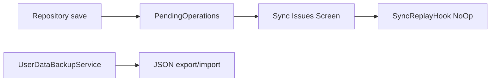

# Local-First UX & Dead API Cleanup v1

## Punti coperti

| # roadmap | Descrizione |
|-----------|-------------|
| **1 (A)** | Nascondere sync UI; backup/restore come path principale |
| **5** | Rimuovere API morte e contratti fuorvianti |

## Supersede

Sostituisce **opzione A** di [`feature-30-sync-strategy-v2.plan.md`](feature-30-sync-strategy-v2.plan.md).  
Marcare quel piano `status: superseded` in frontmatter al merge di questo piano.

## Obiettivo prodotto

L'utente non vede più "sync", "conflitti remoti" o "API non configurata".  
Multi-device = **Backup & restore** in Settings (già implementato).

## Stato attuale



- `SyncReplayHook` — no-op globale
- `SyncIssuesScreen` — 436 righe, copy "remoto"
- `PendingOperations` — ancora scritto su save
- `skipCache` — no-op in local-first
- `customersApiNotConfigured` — l10n morta (GYMBLOG)

## Implementazione

### Fase 1 — Rimuovere superficie UX sync

| File | Azione |
|------|--------|
| `lib/features/settings/presentation/screens/settings_screen.dart` | Rimuovere `SyncSettingsSection` |
| `lib/features/settings/presentation/widgets/sync_settings_section.dart` | Eliminare file |
| `lib/features/settings/presentation/screens/sync_issues_screen.dart` | Eliminare file |
| `lib/core/routing/app_routes.dart` | Rimuovere route sync-issues |
| `lib/core/routing/route_redirect.dart` | Verificare protected paths |

**Tenere (per ora):** `lib/core/sync/pending_operation_resolver.dart`, `sync_replay_hook.dart` — usati da test; no-op OK.

### Fase 2 — Outbox interna (decisione tecnica)

**Opzione conservativa (consigliata PR1):** non scrivere più `PendingOperations` da repository; lasciare tabella Drift per migrazione dati esistenti.

**Opzione aggressiva (PR2+):** migration Drift drop tabella — solo dopo backup export testato.

File da audit:

- `lib/core/storage/offline_local_store.dart` — metodi pending ops
- Repository che chiamano enqueue pending

### Fase 3 — Dead API & copy

```dart
// PRIMA
Future<List<Customer>> getAll({bool skipCache = false})

// DOPO
Future<List<Customer>> getAll()
```

- `lib/features/customers/presentation/screens/customer_list_screen.dart` — refresh → semplice `getAll()`
- `l10n/app_*.arb` — rimuovere `customersApiNotConfigured`
- `pubspec.yaml` — commento Dio: "Hevy export API client"

### Fase 4 — Stub UX

| File | Azione |
|------|--------|
| `lib/features/landing/presentation/screens/landing_screen.dart` | Nascondere CTA non implementate |
| `lib/features/settings/presentation/screens/subscription_screen.dart` | Idem upgrade buttons |
| `lib/core/utils/not_implemented.dart` | Tenere per dev; non usare in path produzione |

## Ordine PR

1. `refactor/remove-sync-settings-ui` — routing + settings + delete screens
2. `refactor/remove-skip-cache-dead-l10n` — API + l10n + commenti
3. `refactor/stop-pending-ops-writes` — data layer (separato, più rischioso)
4. `docs/sync-strategy-decision-a` — doc update

## Verifica manuale QA

- [ ] Settings mostra backup/restore, non sync
- [ ] Nessuna route `/sync-issues` raggiungibile
- [ ] Pull-to-refresh lista clienti funziona
- [ ] Export/import backup round-trip OK
- [ ] `flutter analyze` + `flutter test test/`

## Rischi

- Utenti con pending ops legacy in DB — considerare messaggio one-time "dati migrati" o silent discard
- Test `pending_operation_resolver_test.dart` — aggiornare se si smette di scrivere outbox

## Dipendenze

- Consigliato dopo [`platform-ci-docs-v1`](platform-ci-docs-v1.plan.md)
- Prima di [`presentation-split-v1`](presentation-split-v1.plan.md) su customer/workout screens
