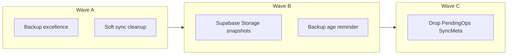

# Persistenza local-first + quasi-cloud + cleanup

Decisioni chiuse: **1B** (Supabase Storage manuale + reminder, niente upload automatico) e **2B** (soft cleanup prima, drop schema in onda separata).

Non rientra nello scope: sync live, `SyncOrchestrator`, CRUD Supabase su entità coach, Google Drive.

---

## Wave A — Eccellere nel path locale + soft cleanup

Branch suggerito: `feat/local-first-backup-excellence`

### A1. Backup preferences complete

Oggi [`user_data_backup_service.dart`](lib/core/backup/user_data_backup_service.dart) esporta solo `notificationsEnabled` + `localUserProfile`.

- Estendere `preferences` (additive, stesso `schemaVersion` v1) con i campi di [`UserPreferences`](lib/features/settings/data/user_preferences_repository.dart): `localeCode`, `calendarRemindersEnabled`, `calendarReminderLeadHours`, `workoutBuilderCompactAdd`, `workoutBuilderIncludeMobilityDefault`.
- Restore nel gruppo `BackupEntityGroup.preferences` via `UserPreferencesRepository`.
- **Escludere la Hevy API key** da export (locale e cloud): resta solo su device; documentare in settings copy.
- Aggiornare [`13-user-data-backup-json-compat.mdc`](.cursor/rules/13-user-data-backup-json-compat.mdc) + test codec (payload minimali vecchi + nuovi campi).

### A2. Envelope senza rumore legacy (writer)

- Smettere di **scrivere** `pendingOperations` / `syncMeta` nei nuovi export.
- Reader: continuare a tollerare chiavi assenti o presenti (compat v1); su restore full-replace, **ignorare** pending/syncMeta invece di reinserirli in Drift.
- Aggiornare regola backup + test.

### A3. Soft cleanup sync / dashboard

- Dashboard: smettere di chiamare `readPendingOperations()` in [`dashboard_snapshot_loader.dart`](lib/features/dashboard/data/dashboard_snapshot_loader.dart); rimuovere campi inutilizzati (`attentionPending` / `queuedSyncCount`) da snapshot se non usati in UI.
- Rimuovere o spostare in `test/`-only / archive i moduli app-dead in `lib/core/sync/`: `pending_operation_resolver.dart`, `sync_issue_filters.dart`, `sync_replay_hook.dart`, `local_first_sync_config.dart` (tenere `offline_models.dart` + `offline_repository_support.dart`).
- Pulire commenti GymBlog residui: `customer_measurement.dart`, `customer_exercise_record.dart`, `workout_plan_api_model.dart`.
- Fix web: gate `backupOnboardingWebHint` con `kIsWeb`; in sign-out web, allineare cleanup reminder prefs a wipe Drift ([`settings_sign_out.dart`](lib/features/settings/presentation/settings_sign_out.dart)).
- Aggiornare frontmatter di [`.cursor/plans/local-first-ux-v1.plan.md`](.cursor/plans/local-first-ux-v1.plan.md) e [`.cursor/plans/data-layer-v1.plan.md`](.cursor/plans/data-layer-v1.plan.md) a completed (doc hygiene).

### A4. Verifica Wave A

- `flutter analyze` + test backup/dashboard/settings rilevanti.
- Nessuna migration Drift in questa onda.

---

## Wave B — Quasi-cloud (Supabase Storage) + reminder

Branch suggerito: `feat/cloud-backup-snapshots`

**Rischio alto (approvazione esplicita in implementazione):** nuova infra Storage + policy RLS; possibile update privacy/ToS.

### B1. Infra Supabase

Nuova migration sotto [`supabase/migrations/`](supabase/migrations/):

- Bucket privato `user-backups` (o nome equivalente).
- Path obbligatorio: `{userId}/…` con RLS Storage: `auth.uid()::text = (storage.foldername(name))[1]`.
- Policy: authenticated insert/select/delete **solo** sul proprio prefisso; niente accesso anon.
- Limiti MVP: max **5** snapshot per utente (enforce in app; opzionale Edge Function dopo); size soft-limit documentato (es. 5–10 MB JSON).
- Nessuna tabella Postgres per business data.

### B2. App layer

Nuovo modulo sottile (es. `lib/core/backup/cloud_backup_repository.dart`):

- `uploadLatest(userId, json)` → `userId/backups/{isoTimestamp}.json`
- `list(userId)`, `download(path)`, `delete(path)` + prune oltre 5
- Riutilizza `UserDataBackupService.buildExportJsonPretty` (stesso envelope v1)
- Import cloud → stesso path di [`SettingsBackupHandler.importBackup`](lib/features/settings/presentation/settings_backup_handler.dart) (preview + merge/replace + gruppi)

UI in [`settings_screen_content.dart`](lib/features/settings/presentation/widgets/settings_screen_content.dart):

- Azioni: “Salva in cloud”, “Ripristina da cloud” (lista timestamp), resta Share/FilePicker come fallback offline
- Sign-out: opzione “Carica in cloud prima di uscire” oltre a export file ([`sign_out_confirmation_dialog.dart`](lib/features/settings/presentation/sign_out_confirmation_dialog.dart))

Persistenza locale timestamp ultimo backup riuscito (file **o** cloud) in SharedPreferences (nuovo key in `settings_prefs_keys`).

### B3. Reminder (no auto-upload)

- Se autenticato e ultimo backup > **7 giorni** (costante configurabile): chip/banner su dashboard e/o riga Settings (riuso pattern attention/onboarding esistente).
- CTA → Settings backup section.
- Dismiss temporaneo (es. snooze 3 giorni) via prefs — non nascondere per sempre il rischio web.
- Copy esplicita: **snapshot opzionale, non sync**; FAQ landing aggiornata (oggi dice “no automatic cloud sync” — va affinata: sync automatico no, snapshot opt-in sì).

### B4. Legal / docs

- Aggiornare privacy/ToS (client PII nello snapshot cloud) e [`docs/sync-strategy.md`](docs/sync-strategy.md) con sezione “Cloud snapshots ≠ sync”.
- Regola agent: cloud snapshot permesso; deny-list sync live invariato in [`07-local-data-and-integrations.mdc`](.cursor/rules/07-local-data-and-integrations.mdc).

### B5. Verifica Wave B

- Test repository con fake Storage client.
- Manual QA: upload → list → download → merge; wrong-account; sign-out upload-then-wipe.
- Deploy migration su progetto Supabase (step gated).

---

## Wave C — Drop schema legacy

Branch suggerito: `refactor/drop-pending-ops-schema`

**Precondizione:** Wave A mergeata; backup round-trip senza dipendere da `pendingOperations`/`syncMeta`; Wave B opzionale ma consigliata (recovery cloud).

- Incrementare `schemaVersion` in [`app_database.dart`](lib/core/storage/app_database.dart): drop tabelle `PendingOperations` e `SyncMetaEntries`.
- Rimuovere [`pending_operations_store.dart`](lib/core/storage/pending_operations_store.dart), metodi backup list pending/syncMeta, migration SP legacy pending batch se obsoleta.
- Aggiornare test Drift / offline store.
- Release notes: “pulizia storage interno; esportare backup prima dell’update” (soprattutto web).

---

## Fuori scope (esplicito)

- Upload automatico periodico / background
- Client-side encryption oltre at-rest Storage (valutare solo se threat model lo richiede dopo MVP)
- Gating Pro obbligatorio sugli snapshot (si può aggiungere dopo)
- Normalizzazione `planData` o sync per-campo

---

## Ordine di esecuzione e PR

| Onda | PR tipici | Gate |
|------|-----------|------|
| A | 1–2 PR | analyze + test backup/dashboard |
| B | 1 PR app + 1 migration/docs (o stacked) | approvazione Storage/RLS + privacy |
| C | 1 PR | approvazione schema drop + backup pre-update |

Piano prodotto da aggiungere in [`.cursor/plans/`](.cursor/plans/) come `local-first-persistence-v1.plan.md` all’avvio Wave A, e indice in README plans.
