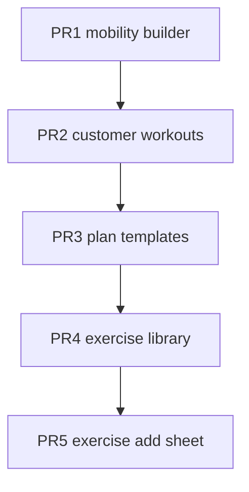

# Presentation Layer Split v1

## Punti coperti

| # roadmap | Descrizione |
|-----------|-------------|
| **2** | Spezzare mega-file presentation |

## Obiettivo

Ridurre file >900 righe senza cambiare UX. Ogni PR tocca **un solo screen** + widget estratti.

## Pattern di riferimento (già nel repo)

| Esempio buono | Ruolo |
|---------------|-------|
| `workout_editor_controller.dart` | Stato save/dirty fuori dal widget |
| `workout_builder_session_controller.dart` | Sessione builder isolata |
| `workout_mobility_tab.dart` | Tab body estratto da screen |
| `workout_builder_editor_shell.dart` | Shell layout riusabile |
| `customer_detail_*_tab.dart` | Tab pattern su customer detail |

## Target files

| File | Righe | Estrazioni proposte |
|------|-------|---------------------|
| `lib/features/workouts/presentation/screens/workout_builder_mobility_screen.dart` | 1291 | `MobilityBuilderController`, `MobilitySectionPicker`, `MobilityItemEditorSheet` |
| `lib/features/customers/presentation/screens/customer_workouts_screen.dart` | 1108 | `CustomerWorkoutPlanList`, `CustomerSessionPanel`, `AssignPlanSheet` |
| `lib/features/workouts/presentation/screens/workout_plan_templates_screen.dart` | 1071 | `TemplateFilterBar`, `TemplateListTile`, `TemplateDuplicateDialog` |
| `lib/features/exercise_library/presentation/screens/exercise_library_screen.dart` | ~937 | `ExerciseImportSection`, `ExerciseLibraryList`, `ExercisePinControls` |
| `lib/features/workouts/presentation/widgets/exercise_add_sheet.dart` | ~925 | `ExerciseSearchPanel`, `ExerciseSelectionList`, `ExerciseAddActions` |

## Regole per ogni PR

1. **Nessun behavior change** — solo move/rename/extract
2. Screen resta entry point routing — delega a widget + controller
3. Controller = `ChangeNotifier` o classe stateless con callback (match existing)
4. Widget estratti in `presentation/widgets/` della stessa feature
5. Max ~400 righe per file risultante
6. `flutter analyze` + `flutter test test/` green

## PR sequence

Branch naming:

- `refactor/split-mobility-builder-screen`
- `refactor/split-customer-workouts-screen`
- etc.

## Test minimi per split

| PR | Test suggerito |
|----|----------------|
| Mobility | Estendere `workout_builder_widgets_test.dart` per nuovo shell |
| Customer workouts | Widget smoke `CustomerWorkoutPlanList` con fake repo |
| Templates | Test helper già in `workout_template_list_helpers_test.dart` |
| Exercise library | Estendere `exercise_picker_sheet_test.dart` pattern |
| Exercise add sheet | Widget test search + selection count |

## Rischi

- Regressioni drag/reorder mobility — test manuale + existing `workout_mobility_mutations_test.dart`
- Context/`GoRouter` perso dopo extract — usare callback espliciti
- Merge conflicts se più PR aperti — **sequenziali obbligatori**

## Dipendenze

- Dopo [`local-first-ux-v1`](local-first-ux-v1.plan.md) su `customer_workouts_screen` (meno sync copy da estrarre)
- Parallelo a [`data-layer-v1`](data-layer-v1.plan.md) se file diversi
