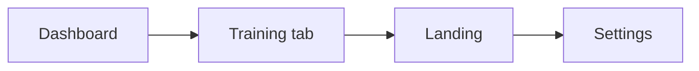

# Presentation Split v3 (opzionale)

## Quando attivarlo

Solo se serve ridurre ulteriormente la complessità di manutenzione. **v1/v2 hanno già chiuso i mega-file >900 righe sui flussi coach critici.**

## Candidati (ordinati per dimensione)

| Priorità | File | Righe | Estrazioni proposte |
|----------|------|------:|---------------------|
| 1 | `lib/features/dashboard/presentation/screens/coach_dashboard_screen.dart` | 795 | Today command panel, stats row, quick actions, appointment strip |
| 2 | `lib/features/workouts/presentation/widgets/workout_training_tab.dart` | 790 | Delegare a `training_week_day_panel` + handler; estrarre toolbar week/day |
| 3 | `lib/features/landing/presentation/screens/landing_screen.dart` | 766 | Hero, feature grid, pricing/CTA — widget statici per sezione |
| 4 | `lib/features/workouts/presentation/widgets/training_week_day_panel.dart` | 562 | Exercise list body, day header actions |
| 5 | `lib/features/settings/presentation/screens/settings_screen.dart` | 548 | Sezioni prefs, backup/export, locale/theme tiles |
| 6 | `lib/features/customers/presentation/screens/customer_detail_screen.dart` | 494 | Ridurre orchestrazione tab (tab body già estratti) |
| 7 | `lib/features/customers/presentation/screens/customer_list_screen.dart` | 484 | Filter bar, list tile, empty states |
| 8 | `lib/features/workouts/presentation/widgets/workout_training_helpers.dart` | 474 | Dialog builders → handler dedicato (come mobility) |
| 9 | `lib/features/workouts/presentation/widgets/mobility_add_sheet.dart` | 449 | Allineare pattern `exercise_add_sheet` |

## Regole (invariate da v1)

- Nessun behavior change intenzionale
- Un PR per file/scope
- Target ~400 righe per screen risultante
- Branch: `refactor/<scope>-<short-description>`
- Verifica: `flutter analyze --no-pub` + `flutter test test/ --no-pub`

## Sequenza suggerita

Dashboard e training tab hanno il maggiore impatto sul flusso coach quotidiano; landing/settings sono più isolati.

## Test minimi suggeriti

| PR | Test |
|----|------|
| Dashboard | Widget smoke su pannello “today” con dati fake |
| Training tab | Estendere `workout_builder_widgets_test.dart` |
| Landing | Smoke sezione hero (no network) |
| Settings | Widget test tile backup/locale se toccati |

## Non in scope v3

- Refactor data layer (`data-layer-v1` — quasi completo)
- Feature roadmap (#24–#31)
- Sync/remote replay (legacy, non attivo)
- File già ≤401 righe dai target v1

## Riferimenti

- Chiusura v1: [`presentation-split-v1.plan.md`](presentation-split-v1.plan.md)
- Follow-ups: [`presentation-split-followups.plan.md`](presentation-split-followups.plan.md), [`presentation-split-followups-v2.plan.md`](presentation-split-followups-v2.plan.md)
