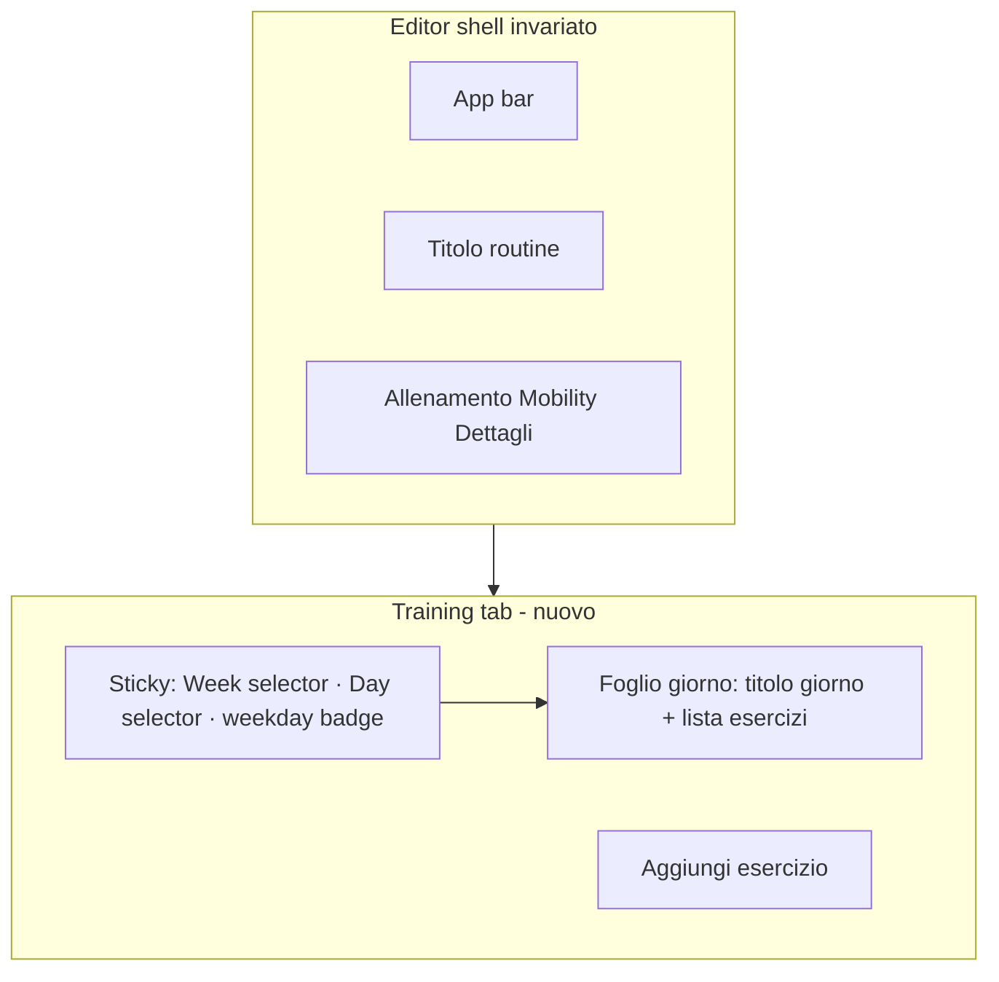

# Workout Builder — Foglio sessione

## Problema (dal screenshot attuale)

- Chrome a 3 livelli: rail **SETTIMANE** + card **Giorni** + label **GIORNI** + chip weekday
- Contenuto vero (esercizi) schiacciato in basso; molto spazio vuoto
- Card esercizio collassata mostra summary opaco (`1` invece di `3×10`)
- Linguaggio “admin dashboard” (box, pill uppercase, bordi pesanti)

## Nuova metafora: foglio sessione

Il giorno selezionato è una **scheda allenamento a pieno campo**. Week e day sono navigazione secondaria in una **toolbar sticky**, non contenitori.



### Layout target

**Desktop e mobile (stesso modello, densità diversa):**

```
┌─────────────────────────────────────────────────────────┐
│  [S1 ▾]  Giorno 1 · Giorno 2 · +    Lun ▾   ⋮ day     │  ← sticky toolbar
├─────────────────────────────────────────────────────────┤
│                                                         │
│  Giorno 1                                    Storico    │  ← sheet header
│  1 esercizio                                            │
│                                                         │
│  Good Morning                              3×10    ›    │  ← riga esercizio
│  ───────────────────────────────────────────────────    │
│  Squat                                     5×5     ›    │
│                                                         │
│                              [ + Aggiungi esercizio ]   │
└─────────────────────────────────────────────────────────┘
```

Principi:
- **Niente** `WorkoutExpandableCard` per week/day
- **Niente** rail 220px “SETTIMANE” (sostituito da dropdown/segment week nella toolbar)
- Weekday: **badge** “Lun” che apre un piccolo menu/sheet — non 7 chip sempre visibili
- Esercizi: **lista flat** (dividers / spacing), non card-in-card; expand apre set/note sotto la riga
- Tipografia: nome esercizio = `titleMedium`; prescrizione = `bodyMedium` `onSurfaceVariant`
- FAB resta, ma con più aria e padding lista adeguato

## Scope

**In scope:** training tab layout + exercise row + summary fix  
**Fuori scope ora:** redesign Mobility/Dettagli/app bar/export; drag-reorder training; two-pane desktop editor

Branch da `main`: `feat/workout-builder-session-sheet`

---

## 1. Toolbar sticky week/day

Riscrivere [`training_week_day_panel.dart`](lib/features/workouts/presentation/widgets/training_week_day_panel.dart):

- Rimuovere split desktop rail + `_DayEditorPane` nested cards
- Nuovo widget `TrainingSessionToolbar` (file nuovo sotto `widgets/`):
  - Week: `PopupMenuButton` / dropdown “Settimana N” (+ Nuova / ⋮ azioni week)
  - Days: chip orizzontali sottili (non uppercase section labels)
  - Weekday: `TextButton` badge → menu 7 giorni
  - Overflow day (rename/delete/clone) nel ⋮
- Sticky: toolbar fissa in alto del tab; sotto scrolla solo il foglio

Riusare callback esistenti (`onSelectWeek`, `onSelectDay`, `onUpdateScheduledWeekday`, …). Deprecare uso di `TrainingWeekVerticalList` nel builder (file può restare se usato altrove, altrimenti lasciare orphan-safe).

## 2. Foglio giorno (sheet header + lista)

In `_DayEditorPane` (o sostituto `TrainingSessionSheet`):

- Header: nome giorno (`headlineSmall` / `titleLarge`), count esercizi, Storico / Log session come text actions (non clutter icon-only senza label se spazio)
- Body: `WorkoutDayExerciseList` ridisegnato
- Empty state centrato con CTA unica (senza FAB duplicato se lista vuota)

## 3. Riga esercizio tipografica

Rifattorire [`workout_exercise_card.dart`](lib/features/workouts/presentation/widgets/workout_exercise_card.dart):

- Collapsed: `Nome` | `prescrizione` | chevron | ⋮ — **senza** bordo card pesante (padding + divider sotto)
- Expanded: set rows + nota + “Aggiungi serie” (logica attuale)
- Tap nome/prescrizione → expand; menu → sheet edit avanzato (invariato)

Allineare [`workout_superset_block.dart`](lib/features/workouts/presentation/widgets/workout_superset_block.dart) allo stesso linguaggio flat (bordo accent sottile a sinistra, no card doppia).

Opzionale thin: tenere `WorkoutExpandableCard` solo se adattato a stile “row” (padding ridotto, no shadow); altrimenti inline Column nel exercise card.

## 4. Fix summary `"1"`

In [`workout_routine_model.dart`](lib/features/workouts/data/workout_routine_model.dart):

- `effectiveSetDetails` legacy fallback: passare anche `sets: this.sets`
- `displayText`: se manca reps/load e sets è solo default, UI mostra placeholder via l10n (es. “Aggiungi serie”) nella card invece di `"1"` nudo

Test unitario su `displayText` / fallback.

## 5. Shell light touch

[`workout_training_tab.dart`](lib/features/workouts/presentation/widgets/workout_training_tab.dart): ridurre padding esterno; il foglio usa max-width ~720–840 su desktop centrato per eleganza (legibilità scheda).

## 6. l10n + test

- Nuove stringhe se servono (placeholder prescrizione, tooltip toolbar)
- Aggiornare [`workout_builder_widgets_test.dart`](test/features/workouts/workout_builder_widgets_test.dart) (niente expand planner card)
- Test toolbar: select week/day
- Test exercise row expand isolation (già pattern in expandable card test)

## Verifica

- `flutter analyze`
- `flutter test test/features/workouts/`
- QA: 1 settimana / multi-settimana; empty day; expand set; weekday badge; desktop narrow + wide; mobile

## Rischi

- Coach abituati al rail settimane: la toolbar dropdown deve rendere evidente settimana attiva
- Non toccare handlers/controller salvo dove summary/model richiede fix
- Superset deve restare riconoscibile (accent left bar)
