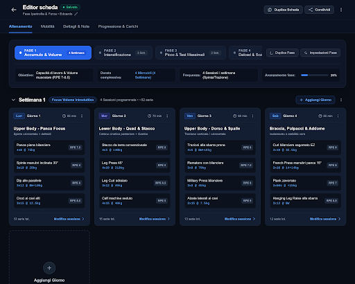
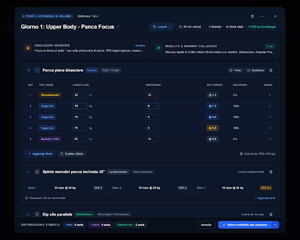
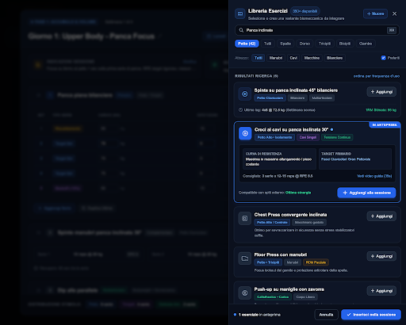
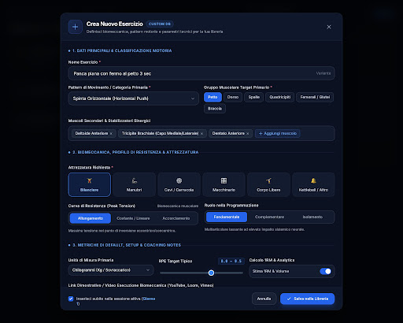
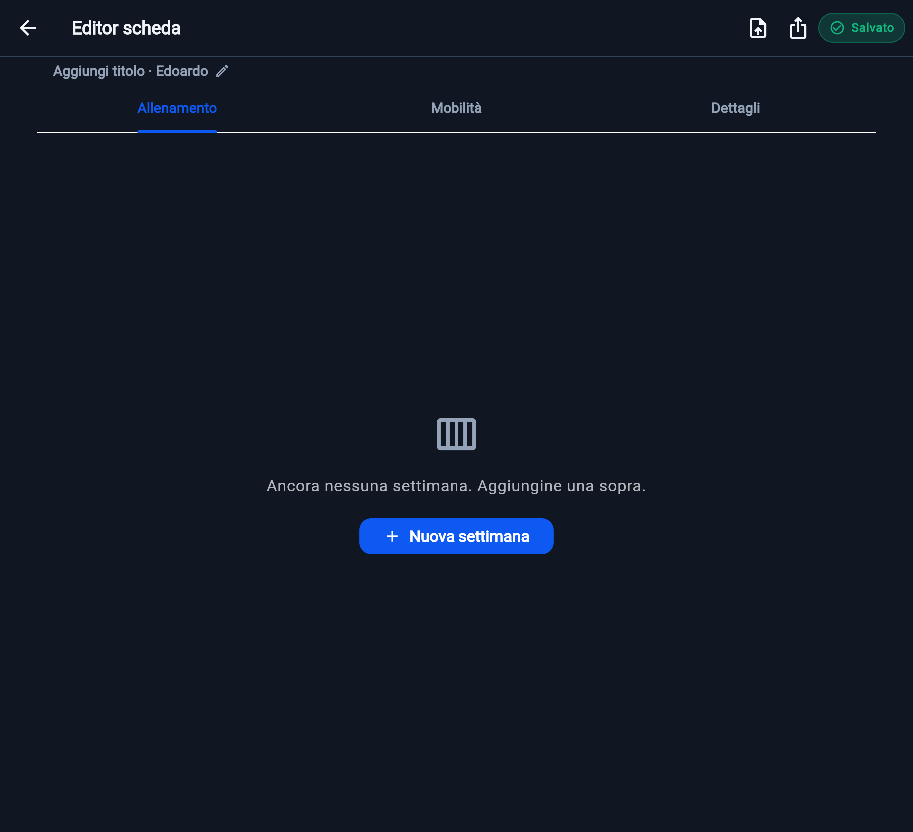
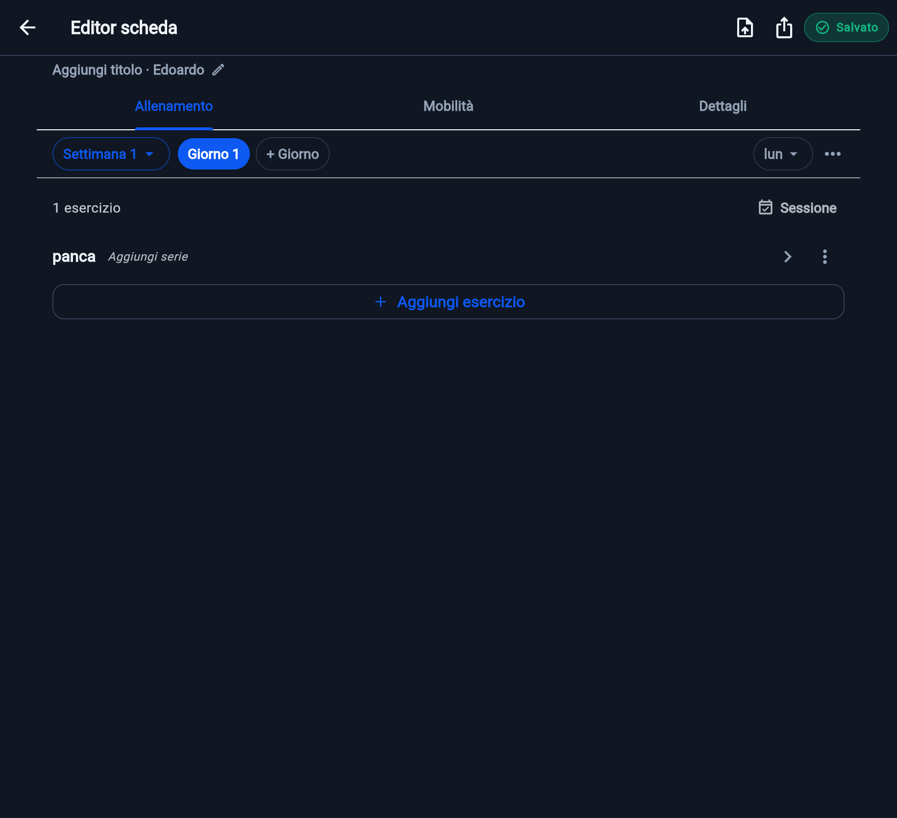
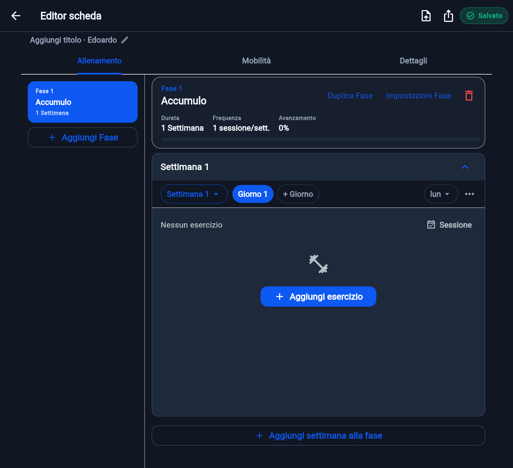
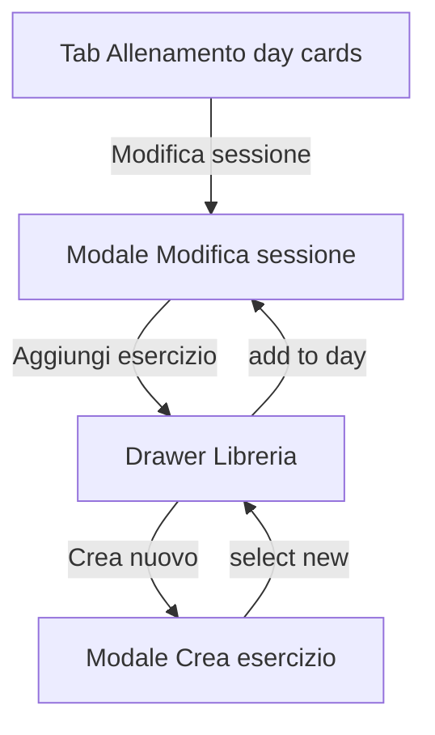

# Feature 50 — Stitch editor UI parity (identica al prototipo)

Indice canonico: [`feature-50-stitch-editor-ui-parity.plan.md`](feature-50-stitch-editor-ui-parity.plan.md)

## Decisioni chiuse

- **Scope 1B:** tutto il flusso editor Stitch (non solo tab Allenamento).
- **Editing sessione:** **modale full-screen** “Modifica sessione”; rimuovere l’editor inline sotto la griglia giorni.
- **Branch:** continuare su `feat/workout-plan-phases` (modello fasi già presente); commit UI dedicati.
- **Source of truth:** Stitch project `14496212854931615246` + asset locali sotto `design/stitch-assets/phase-planning-ui/`.

## Screen Stitch da coprire

Asset locali (PNG + HTML) in [`design/stitch-assets/phase-planning-ui/`](../../design/stitch-assets/phase-planning-ui/). Progetto Stitch `14496212854931615246`.

### 1. Editor Scheda — Gestione Fasi e Settimane (`1ce9870f…`)

Shell Allenamento: pills fasi, meta, week blocks, day cards.

- PNG: `editor-fasi-settimane.png`
- HTML: `editor-fasi-settimane.html`

### 2. Dettaglio Modale — Modifica Sessione (`bcce5d2f…`)

Modale full-screen sessione (lista esercizi, CTA, chrome).

- PNG: `modale-modifica-sessione.png`
- HTML: `modale-modifica-sessione.html`

### 3. Modale Sessione + Drawer Libreria (`69ff0f74…`)

Add esercizio → pannello laterale libreria.

- PNG: `modale-sessione-drawer-libreria.png`
- HTML: `modale-sessione-drawer-libreria.html`

### 4. Modale Creazione Esercizio Personalizzato (`ddf780ed…`)

Create custom da libreria.

- PNG: `modale-crea-esercizio.png`
- HTML: `modale-crea-esercizio.html`

### 5. Workout Program & Session Editor (`1d3586c6…`)

Cross-check layout/composizione (solo HTML in Stitch; nessun screenshot server-side).

- HTML: `workout-program-session-editor.html`

### Ref aggiuntivi (upload utente / Stitch)

## Gap vs codice attuale

| Area | Oggi | Target Stitch |
|------|------|---------------|
| Session edit | Inline `_SessionEditPanel` in [`workout_training_tab.dart`](../../lib/features/workouts/presentation/widgets/workout_training_tab.dart) | `showAppBottomSheet(fullScreen: true)` |
| Add exercise | Monolithic [`exercise_add_sheet.dart`](../../lib/features/workouts/presentation/widgets/exercise_add_sheet.dart) | Drawer/side panel da sessione (desktop); sheet mobile |
| Create custom | Mix in add sheet / [`custom_exercise_edit_dialog.dart`](../../lib/features/exercise_library/presentation/widgets/custom_exercise_edit_dialog.dart) | Modale dedicata da drawer |
| Allenamento chrome | Parzialmente riscritto (pills/grid) | Pixel/layout pass vs HTML: densità, badge, week subtitle, azioni |

Handlers/domain fasi restano: nessuna migrazione Drift; riuso `WorkoutDayExerciseList` e mutazioni esistenti.

## Workstream A — Asset + Allenamento parity

1. Asset Stitch già syncati in `design/stitch-assets/phase-planning-ui/` (vedi sezioni screen sopra).
2. Pass UI su [`training_phase_rail.dart`](../../lib/features/workouts/presentation/widgets/training_phase_rail.dart), [`training_phase_detail_header.dart`](../../lib/features/workouts/presentation/widgets/training_phase_detail_header.dart), [`training_phase_day_card.dart`](../../lib/features/workouts/presentation/widgets/training_phase_day_card.dart), [`workout_training_tab.dart`](../../lib/features/workouts/presentation/widgets/workout_training_tab.dart):
   - strip pills + azioni (Aggiungi / Duplica / Impostazioni)
   - meta chips + progress
   - week header + griglia day card
   - CTA “Aggiungi settimana alla fase”
3. Day card: preview esercizi, “Modifica sessione” apre **solo** la modale (niente pannello sotto griglia).

## Workstream B — Modale Modifica sessione

1. Estrarre body da `_SessionEditPanel` → es. [`training_session_edit_sheet.dart`](../../lib/features/workouts/presentation/widgets/training_session_edit_sheet.dart).
2. Aprire con `showAppBottomSheet(..., fullScreen: true)` (pattern come [`workout_builder_superset_editor_sheet.dart`](../../lib/features/workouts/presentation/widgets/workout_builder_superset_editor_sheet.dart)).
3. Chrome Stitch: titolo giorno/settimana, azioni rinomina/nota/duplica/elimina, lista esercizi (`WorkoutDayExerciseList`), CTA Aggiungi esercizio.
4. Rimuovere `_editingSession` inline panel dal tab; tenere highlight opzionale sulla day card selezionata.

## Workstream C — Drawer libreria

1. Estrarre pick-only da [`exercise_add_library_picker.dart`](../../lib/features/workouts/presentation/widgets/exercise_add_library_picker.dart) in pannello riusabile.
2. Da “Aggiungi esercizio” nella modale sessione:
   - **Desktop:** side panel / end-drawer overlay (nuovo helper es. `showAppSidePanel` accanto a [`app_sheet.dart`](../../lib/core/ui/widgets/app_sheet.dart) se manca).
   - **Mobile:** bottom sheet libreria (stesso contenuto).
3. Selezione → aggiunge al giorno (default set) e resta in modale sessione; edit prescrizione via card esistenti.

## Workstream D — Modale crea esercizio

1. Da drawer: CTA “Crea esercizio” → `showAppBottomSheet(wrapContent: true)` con form allineata a Stitch, riusando [`CustomExerciseEditDialog`](../../lib/features/exercise_library/presentation/widgets/custom_exercise_edit_dialog.dart) / campi create.
2. On success: esercizio in libreria + selezionabile / aggiunto al giorno; chiudi create, resta drawer o torna a sessione.

## Workstream E — Verify

- `flutter analyze` + widget test: Apri modale da day card; add da drawer; create custom; empty states.
- Aggiornare [`workout_builder_widgets_test.dart`](../../test/features/workouts/workout_builder_widgets_test.dart) (niente editor inline).
- Mantenere indice [`README.md`](README.md) e questo piano allineati.

## Fuori scope

- Tab “Progressione & Carichi” (solo nel mock header Stitch)
- Gym mode / session log execution
- Cambio modello `Phase` / codec
- Pixel-perfect font esterni non nel design system app (usare `StitchM3Theme` tokens)

## Ordine implementazione

A (asset + shell) → B (modale sessione) → C (drawer) → D (create) → E (test/docs).

## Follow-up screens F50–F55

Asset folder: [`design/stitch-assets/phase-planning-ui/`](../../design/stitch-assets/phase-planning-ui/)

| ID | Screen | Assets | Implementation notes |
|----|--------|--------|----------------------|
| **F55** | Density → library drawer | [`f55-density-to-drawer.png`](../../design/stitch-assets/phase-planning-ui/f55-density-to-drawer.png) · [`f55-density-to-drawer.html`](../../design/stitch-assets/phase-planning-ui/f55-density-to-drawer.html) | Highest priority: `showAddExerciseToSupersetDialog` → `showExerciseLibraryPickPanel` (pick-only, `useRootNavigator`), add via `buildExerciseFromPrescription` + `supersetGroupId` + `defaultExerciseSetDetails()`. CTA label `builderDensityAddExercise`. |
| **F51** | Session editor mode | [`f51-sessione-editor-mode.png`](../../design/stitch-assets/phase-planning-ui/f51-sessione-editor-mode.png) · [`f51-sessione-editor-mode.html`](../../design/stitch-assets/phase-planning-ui/f51-sessione-editor-mode.html) | Optional `editorMode` / `planId` / `customerName` / `onLogSession` on session sheet: badge + Log session + History. Thread `editorCustomerName` from mobility / tabs config. |
| **F53** | Empty session day | [`f53-sessione-giorno-vuoto.png`](../../design/stitch-assets/phase-planning-ui/f53-sessione-giorno-vuoto.png) · [`f53-sessione-giorno-vuoto.html`](../../design/stitch-assets/phase-planning-ui/f53-sessione-giorno-vuoto.html) | Title `workoutBuilderSessionEmptyTitle` + empty-day CTA; day toolbar stays visible. |
| **F52** | Library drawer states | [`f52-drawer-libreria-stati.png`](../../design/stitch-assets/phase-planning-ui/f52-drawer-libreria-stati.png) · [`f52-drawer-libreria-stati.html`](../../design/stitch-assets/phase-planning-ui/f52-drawer-libreria-stati.html) | True empty → `exerciseLibraryEmpty` + hint + create CTA; search empty keeps `workoutBuilderCompactAddEmpty`. |
| **F50** | Density group manage | [`f50-density-group.png`](../../design/stitch-assets/phase-planning-ui/f50-density-group.png) · [`f50-density-group.html`](../../design/stitch-assets/phase-planning-ui/f50-density-group.html) | Light parity (F55 wiring + density add label). Full Stitch chrome deferred. |
| **F54** | Nested stack desktop | [`f54-nested-stack-desktop.png`](../../design/stitch-assets/phase-planning-ui/f54-nested-stack-desktop.png) · [`f54-nested-stack-desktop.html`](../../design/stitch-assets/phase-planning-ui/f54-nested-stack-desktop.html) | Reference only — no new UI. Nested navigators already correct (`useRootNavigator` on pick + create). |

