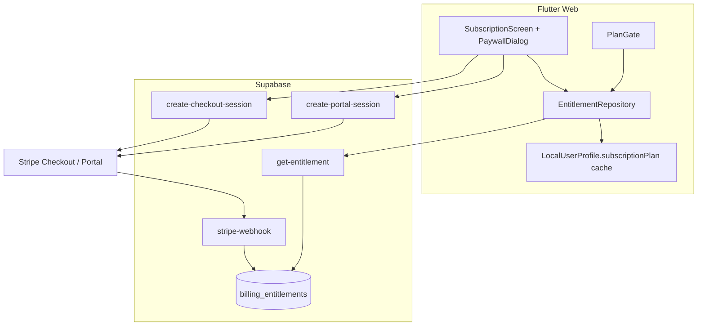

# Web launch Phase 2 — Billing Stripe + paywall Free/Pro

## Contesto

| Item | Stato |
|------|--------|
| **Phase 1** (trust/legal) | ✅ Merged `#89` — logout sicuro, legal in-app, onboarding backup |
| **Canale lancio** | **Web only** — https://powercoach-studio.vercel.app |
| **Modello dati** | **Local-first (A)** — Drift/IndexedDB; Supabase **auth only** oggi |
| **Abbonamento attuale** | `subscriptionPlan` in SharedPreferences (`free`/`pro`) — **spoofabile**, nessun pagamento |
| **UI esistente** | `SubscriptionScreen` read-only; l10n `subscriptionUpgrade` / `subscriptionManage` **non collegati** |

Phase 2 introduce la **prima eccezione controllata** all’architettura auth-only: una tabella Supabase **solo billing** + Edge Functions Stripe. I dati coach/clienti/workout **restano locali**.

## Obiettivo prodotto

Un coach può:

1. Usare **Free** con limiti chiari (es. max clienti attivi).
2. Passare a **Pro** via **Stripe Checkout** (web).
3. Gestire fatture/cancellazione via **Stripe Customer Portal**.
4. Vedere il piano corrente in **Impostazioni → Abbonamento**.
5. Incontrare un **paywall** quando tenta feature Pro o supera limiti Free.

**Non in scope Phase 2:** Play Billing, App Store, cloud backup, multi-coach Studio tier, analytics prodotto.

---

## Decisioni prodotto ✅ (confermate 2026-07-09)

| Tier | Prezzo | Limiti / inclusioni |
|------|--------|---------------------|
| **Free** | €0 forever | Max **5 clienti attivi** (non archiviati); builder, dashboard, backup JSON, diario base |
| **Pro** | **€12/mese** o **€99/anno** | Clienti illimitati; export progresso CSV; Hevy; export PDF/Excel workout |
| **Trial** | **Nessuno** — solo Free forever fino a upgrade | — |

**Post-cancellazione:** **grace 7 giorni** — webhook `canceled`/`deleted` imposta `pro_until = now + 7d`; gate trattano come Pro finché `pro_until > now`.

**Beta coach:** coupon Stripe 100% o riga manuale `plan=pro` in `billing_entitlements` (runbook interno).

---

## Architettura target



### Principi

1. **Source of truth = Supabase `billing_entitlements`**, aggiornata **solo** da webhook Stripe (e seed admin).
2. **Client cache** in `LocalUserProfileData.subscriptionPlan` per UI offline veloce; **refresh obbligatorio** post-login e post-checkout.
3. **Mai fidarsi** del backup JSON per il piano: dopo import backup, re-fetch entitlement.
4. **Gate lato client** = UX; enforcement reale = stato server (coach non Pro non ottiene checkout session valida se già Pro — opzionale).

---

## Backend — Supabase + Stripe

### Nuova tabella (migration)

`public.billing_entitlements` (1 riga per `user_id` = Supabase auth UUID):

| Colonna | Tipo | Note |
|---------|------|------|
| `user_id` | uuid PK, FK → auth.users | |
| `plan` | text | `free` \| `pro` |
| `stripe_customer_id` | text nullable | |
| `stripe_subscription_id` | text nullable | |
| `status` | text | `active`, `trialing`, `past_due`, `canceled`, `none` |
| `current_period_end` | timestamptz nullable | |
| `pro_until` | timestamptz nullable | Grace Pro for 7 days after cancel |
| `updated_at` | timestamptz | |

**RLS:**

- `SELECT` where `auth.uid() = user_id`
- `INSERT/UPDATE/DELETE` — **solo service role** (webhook Edge Function)

Default row: on first `get-entitlement`, insert `plan=free, status=none` if missing.

### Edge Functions (Deno)

| Function | Auth | Input | Output |
|----------|------|-------|--------|
| `create-checkout-session` | JWT required | `priceId`, `successUrl`, `cancelUrl` | `{ url }` |
| `create-portal-session` | JWT required | `returnUrl` | `{ url }` |
| `get-entitlement` | JWT required | — | `{ plan, status, currentPeriodEnd }` |
| `stripe-webhook` | Stripe signature | raw body | 200/4xx |

**Secrets Supabase:** `STRIPE_SECRET_KEY`, `STRIPE_WEBHOOK_SECRET`, `STRIPE_PRICE_ID_MONTHLY` (e opz. yearly).

**Webhook events minimi:**

- `checkout.session.completed`
- `customer.subscription.updated`
- `customer.subscription.deleted`
- `invoice.payment_failed` (opz. downgrade grace)

### Stripe Dashboard setup

1. Product **PowerCoach Studio Pro**
2. Prices recurring (monthly + opz. yearly)
3. Customer Portal abilitato (cancel, update payment)
4. Webhook endpoint → `https://<project>.supabase.co/functions/v1/stripe-webhook`
5. Redirect URLs allowlist: `https://powercoach-studio.vercel.app/settings/subscription*`

### Repo layout (nuovo)

```
supabase/
  migrations/YYYYMMDDHHMMSS_billing_entitlements.sql
  functions/
    create-checkout-session/index.ts
    create-portal-session/index.ts
    get-entitlement/index.ts
    stripe-webhook/index.ts
docs/
  stripe-billing.md
```

---

## Client — Flutter

### Modulo `lib/core/billing/`

| File | Ruolo |
|------|--------|
| `entitlement_models.dart` | `Entitlement` (plan, status, periodEnd) |
| `entitlement_repository.dart` | Chiama `get-entitlement`, aggiorna cache locale |
| `plan_limits.dart` | Costanti Free: `maxActiveCustomers = 5`, set feature Pro |
| `plan_gate.dart` | `canAddCustomer(count)`, `canExportProgress`, `canUseHevy`, `requirePro(context, feature)` |
| `paywall_dialog.dart` | Messaggio + CTA → `/settings/subscription` |
| `billing_checkout.dart` | Web: Edge Function → `openExternalUrl`; stub no-op off-web |

### Integrazioni puntuali

| Area | File | Comportamento |
|------|------|---------------|
| Abbonamento | `subscription_screen.dart` | Upgrade / Manage; badge piano; refresh on `?checkout=success` |
| Nuovo cliente | `customer_creation_screen.dart` o repository | Prima di save: `PlanGate.canAddCustomer` |
| Export CSV | `customer_detail_overview_tab.dart` | Gate + paywall |
| Hevy | `hevy_settings_section.dart` | Se Free → tile locked o paywall on save key |
| Export workout | `workout_builder_export_actions.dart` | Gate PDF/Excel (JSON backup resta Free) |
| Bootstrap | `main.dart` o post-auth hook | `EntitlementRepository.refresh()` |
| Profilo | `personal_info_screen.dart`, `profile_screen.dart` | Continuare a **preservare** `subscriptionPlan` solo come cache sync da EntitlementRepository |

### Env client (`.env.example`)

```
STRIPE_PUBLISHABLE_KEY=pk_test_...
STRIPE_PRICE_ID_MONTHLY=price_...
STRIPE_PRICE_ID_YEARLY=price_...   # opzionale
```

Price IDs possono stare solo server-side; client needs publishable key only if si usa Stripe.js in futuro — per Checkout redirect **basta URL** da Edge Function.

### Routing

- Success: `/settings/subscription?checkout=success` → snackbar + refresh entitlement
- Cancel: `/settings/subscription?checkout=cancel`
- Nessuna nuova route protetta oltre quelle esistenti

---

## UX paywall

### Pattern

```dart
if (!await PlanGate.canUseHevy()) {
  await showPaywallDialog(context, feature: PaywallFeature.hevy);
  return;
}
```

### Copy l10n (IT/EN)

Nuove chiavi suggerite:

- `paywallTitle`, `paywallMessageCustomers`, `paywallMessageExport`, `paywallMessageHevy`
- `paywallUpgradeCta`, `paywallNotNow`
- `subscriptionCheckoutError`, `subscriptionPortalError`
- `subscriptionCheckoutSuccess`

Riutilizzare `subscriptionUpgrade` / `subscriptionManage` già presenti.

---

## Wave di implementazione (PR)

| PR | Branch suggerito | Contenuto | Dipendenze |
|----|------------------|-----------|------------|
| **2.1** | `feat/billing-supabase-stripe-backend` | Migration + 4 Edge Functions + `docs/stripe-billing.md` + test webhook manuale | Decisioni prodotto + Stripe test mode |
| **2.2** | `feat/billing-entitlement-client` | `EntitlementRepository`, refresh post-login, sync cache profilo | 2.1 deployato |
| **2.3** | `feat/billing-subscription-ui` | Wire `subscription_screen`, checkout/portal redirect, query params success | 2.2 |
| **2.4** | `feat/billing-plan-gates` | `PlanGate` + paywall + gate clienti/export/Hevy/PDF | 2.2 |
| **2.5** | `feat/billing-landing-pricing` | Pricing section landing + FAQ (opzionale) | 2.3 copy tier |

Ogni PR: `flutter analyze` + test mirati; 2.1 validato con Stripe CLI `stripe listen --forward-to`.

---

## Test plan

### Unit

- `plan_gate_test.dart` — limiti clienti Free vs Pro; feature flags
- `entitlement_repository_test.dart` — mock HTTP/Supabase client; cache update

### Widget

- `subscription_screen_test.dart` — loading, Free mostra Upgrade, Pro mostra Manage (mock repo)
- `paywall_dialog_test.dart` — CTA naviga a subscription route

### Manuale (Stripe test mode)

1. Signup nuovo utente → piano Free, max 5 clienti
2. Sesto cliente → paywall
3. Upgrade → Checkout test card `4242...` → ritorno success → Pro
4. Export CSV e Hevy sbloccati
5. Customer Portal → cancel → downgrade (secondo policy grace)
6. Logout/login → piano coerente con server (non solo cache)
7. Safari + Chrome: redirect checkout/portal

---

## Rischi e mitigazioni

| Rischio | Mitigazione |
|---------|-------------|
| Spoof `subscriptionPlan` in prefs | Source of truth server; refresh obbligatorio; gate basato su `EntitlementRepository` |
| Backup import sovrascrive piano | Dopo restore, ignore `subscriptionPlan` da file o force refresh server |
| Webhook perso | Stripe retry; cron opzionale `sync-subscription` (Phase 2.1b se necessario) |
| IndexedDB cleared ma Pro pagato | Dati locali persi ma abbonamento resta; coach re-importa backup — **comunicare in paywall/onboarding** |
| Eccezione architettura auth-only | Documentare in `07-local-data-and-integrations.mdc` e `AGENTS.md`: solo `billing_entitlements` |
| Test VM + `package:web` | Conditional imports (lesson Phase 1 `open_external_url`) |

---

## Definition of done Phase 2

- [ ] Coach può pagare Pro su web via Stripe test/live
- [ ] Limiti Free enforced (almeno conteggio clienti + 1 feature Pro)
- [ ] `SubscriptionScreen` completa (upgrade + manage)
- [ ] Entitlement sincronizzato post-login e post-checkout
- [ ] Documentazione setup Stripe/Supabase per deploy
- [ ] CI verde (`flutter analyze`, test nuovi)
- [ ] Regola cursor/AGENTS aggiornata per billing Supabase

---

## Dopo Phase 2 (Phase 3 — launch beta)

Non parte di questo plan; solo riferimento:

- Landing commerciale + beta chiusa 5–10 coach
- Errori IndexedDB / cross-browser polish
- PWA copy (“Aggiungi a Home”)
- **Futuro:** Android + Play Billing (integrazione separata)

---

## Riferimenti codice esistente

| File | Note |
|------|------|
| `lib/features/settings/presentation/screens/subscription_screen.dart` | UI da estendere |
| `lib/core/storage/local_user_profile_store.dart` | Cache `subscriptionPlan` |
| `lib/core/platform/open_external_url.dart` | Redirect Checkout/Portal su web |
| `lib/core/constants/legal_urls.dart` | Link ToS/privacy già in app |
| `.cursor/plans/web-launch-phase1-trust-legal` (merged #89) | Prerequisito completato |

---

## Checklist operativa pre-implementazione

1. [ ] ~~Confermare tabella tier/prezzi/trial~~ ✅ confermato 2026-07-09
2. [ ] Creare Stripe account + product/price test
3. [ ] Supabase: abilitare Edge Functions billing sullo stesso project auth
4. [ ] Branch `feat/billing-supabase-stripe-backend` da `main`
5. [ ] Implementare PR 2.1 → 2.4 in ordine
