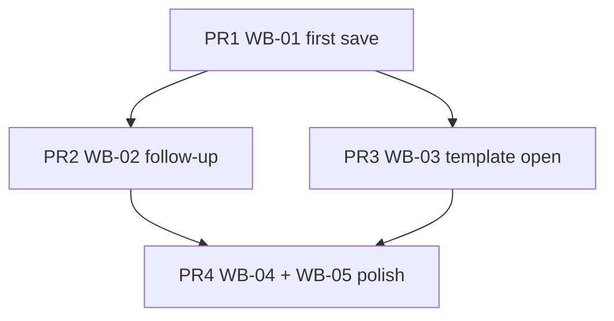

# Workout Builder UX — Fase 1: Trust

## Obiettivo prodotto

Il coach **non perde mai** una scheda in costruzione e vede **comportamenti identici** ovunque tocchi follow-up o template. Gli errori non spariscono in silenzio.

**Prerequisito roadmap:** nessuno — prima fase.  
**Blocca:** fase 2 (WB-06+) finché WB-01 non è mergiato.

## WB-01 — Autosave / save al primo edit (P0 · M)

### Problema

```dart
// workout_editor_controller.dart — autosave skip
if (!editorMode || loadedPlanId == null || !isDirty || onAutosave == null) return;
```

Piano nuovo su `/customers/:id/workouts/new`: tutto il lavoro pre–primo Save manuale è fragile.

### Soluzione proposta (due livelli, stesso PR o split)

**A — Banner persistente (quick, basso rischio)**  
In `WorkoutBuilderEditorShell` o `WorkoutEditorAppBar`: se `editorMode && !hasLoadedPlan`, chip/banner warning + CTA Salva evidenziato.

**B — Create on first autosave (opzionale stesso sprint)**  
Dopo N secondi di dirty state su piano nuovo, chiamare `saveRoutine` (create) automaticamente — stesso path del Save manuale in `WorkoutBuilderRoutineCoordinator`.

### File

| File | Azione |
|------|--------|
| `workout_editor_controller.dart` | Condizione autosave / hook create |
| `workout_builder_routine_coordinator.dart` | Riutilizzare create path |
| `workout_builder_editor_shell.dart` | Banner first-save |
| `app_it.arb` / `app_en.arb` | `workoutBuilderSaveToPersistHint` |

### Acceptance

- [ ] Coach aggiunge esercizi su piano nuovo → vede hint save persistente
- [ ] Dopo primo save, autosave funziona come oggi
- [ ] Exit dialog ancora corretto su piano nuovo dirty

### Branch

`fix/workout-builder-first-save-hint` (+ opz. autosave create)

---

## WB-02 — Unificare follow-up (P1 · S)

### Problema

- `CustomerWorkoutsScreen._createFollowUpWorkout` → dialog + `createFollowUpFromPlan` + carichi eseguiti
- `CustomerDetailWorkoutPlansSection._createFollowUp` → piano **vuoto** + nome generico

### Soluzione

Estrarre helper condiviso (es. `customer_workout_follow_up.dart`) che entrambi chiamano:

```dart
Future<void> createCustomerWorkoutFollowUp(
  BuildContext context, {
  required String customerId,
  required WorkoutPlanApiModel plan,
  required WorkoutPlanRepository planRepo,
  required SessionExecutionService executionService,
  required VoidCallback onSuccess,
});
```

### File

| File | Azione |
|------|--------|
| `customer_detail_workout_plans_section.dart` | Delegare al helper |
| `customer_workouts_screen.dart` | Delegare al helper |
| Nuovo `customer_workout_follow_up.dart` (customers/presentation) | Logica condivisa |

### Acceptance

- [ ] Follow-up da overview = stesso dialog della lista piani
- [ ] Nome, data, apply executed loads coerenti

### Branch

`fix/workout-follow-up-unify`

---

## WB-03 — Post-template “Apri piano” (P1 · S)

### Problema

`WorkoutPlanTemplatesScreen._assignToCustomer` termina con snackbar; coach deve cercare il piano.

### Soluzione

Dopo `duplicateToCustomer`, snackbar con `action`:

```dart
SnackBarAction(
  label: l10n.workoutTemplateOpenPlanAction,
  onPressed: () => navigateTo(
    context,
    customerWorkoutEditorPath(chosenCustomerId, planId: createdPlan.id),
  ),
)
```

### File

| File | Azione |
|------|--------|
| `workout_plan_templates_screen.dart` | Action snackbar + navigate |
| `app_*.arb` | `workoutTemplateOpenPlanAction` |

### Acceptance

- [ ] Assegna template → tap Apri → editor con piano caricato
- [ ] URL web: `/customers/:id/workouts/:planId`

### Branch

`feat/workout-template-open-after-assign`

---

## WB-04 — Empty day CTA (P1 · S)

### Problema

Giorno vuoto: solo testo count=0; FAB in basso poco visibile su mobile.

### Soluzione

In `WorkoutDayExerciseList`, branch empty:

- Icona + copy breve
- `FilledButton.icon(onPressed: onAddExercise, …)`

### File

| File | Azione |
|------|--------|
| `workout_day_exercise_list.dart` | Empty state UI |
| `app_*.arb` | `workoutBuilderEmptyDayCta` |

### Branch

`feat/workout-empty-day-cta`

---

## WB-05 — Errori visibili (P1 · S)

### Problema

`catch (_) {}` o load fallito senza UI in:

- `CustomerWorkoutsScreen` archive/unarchive/complete
- `CustomerDetailScreen` / overview load piani
- `WorkoutDiaryScreen._load`

### Soluzione

Pattern uniforme: `SnackBar` con `colorScheme.errorContainer` + messaggio l10n generico + log debug.

### File

| File | Azione |
|------|--------|
| `customer_workouts_screen.dart` | catch → snackbar |
| `customer_detail_screen.dart` o workout plans section | errore load |
| `workout_diary_screen.dart` | banner errore vs lista vuota |
| `app_*.arb` | `workoutActionFailed`, `workoutPlansLoadError`, `workoutDiaryLoadError` |

### Branch

`fix/workout-silent-error-feedback`

---

## Sequenza PR consigliata



| PR | Contenuto | Effort |
|----|-----------|--------|
| 1 | WB-01 | M |
| 2 | WB-02 | S |
| 3 | WB-03 | S |
| 4 | WB-04 + WB-05 | S |

## Definition of done fase 1

- Tutti i todo frontmatter `completed`
- QA checklist builder passata
- Aggiornare `workout-builder-ux-roadmap.plan.md` todo `phase1-trust` → completed
