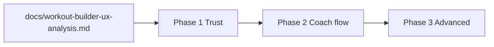

# Roadmap — Workout Builder UX

## Tesi

Il workout builder è il **cuore operativo** del prodotto coach. L’architettura tecnica (superset, autosave, calendario, diario) è matura; il ROI maggiore oggi è su **fiducia**, **coerenza dei flussi** e **meno attrito mobile**, non su nuove varianti builder.

Analisi completa: [`docs/workout-builder-ux-analysis.md`](../../docs/workout-builder-ux-analysis.md).

## Scope per fase

| Fase | Piano | ID backlog | Obiettivo | PR stimati | Effort |
|------|-------|------------|-----------|------------|--------|
| **1** | [phase1-trust](workout-builder-ux-phase1-trust.plan.md) | WB-01 … WB-05 | Zero perdita dati, flussi coerenti, errori visibili | 2–3 | ~1 sett |
| **2** | [phase2-coach-flow](workout-builder-ux-phase2-coach-flow.plan.md) | WB-06 … WB-12, WB-21 | Percorso cliente lineare, logging vicino al builder | 4–5 | ~2–3 sett |
| **3** | [phase3-advanced](workout-builder-ux-phase3-advanced.plan.md) | WB-13 … WB-22 | Palestra mobile, desktop, onboarding, polish | 5+ | backlog |

## Ordine di esecuzione

**Regola:** non iniziare fase 2 finché WB-01 (primo save) non è mergiato — è prerequisito di fiducia per tutto il resto.

## Mapping ID → deliverable

| ID | Titolo breve | Fase |
|----|--------------|------|
| WB-01 | Autosave / banner primo piano | 1 |
| WB-02 | Follow-up unificato | 1 |
| WB-03 | Apri piano post-template | 1 |
| WB-04 | Empty day CTA | 1 |
| WB-05 | Errori visibili | 1 |
| WB-06 | Scelta vuoto/template su nuovo piano | 2 |
| WB-07 | Sandbox builder etichettato | 2 |
| WB-08 | Tab Workout cliente | 2 |
| WB-09 | Log sessione in builder | 2 |
| WB-10 | Duplica giorno/settimana | 2 |
| WB-11 | Read-only archiviati | 2 |
| WB-12 | Hint calendario vuoto | 2 |
| WB-21 | Test journey E2E | 2 |
| WB-13 … WB-22 | vedi fase 3 | 3 |

## Relazione con roadmap prodotto esistente

| Area già coperta (v5/v6) | Non duplicare |
|--------------------------|---------------|
| F36 superset panel | ✅ completato |
| F33 diario v2, F34 stats, F35 session log | ✅ base esiste — WB-09 integra nel builder |
| F04 templates | ✅ base esiste — WB-03/06 migliorano assign |
| presentation-split-v* | Refactor strutturale parallelo, non bloccante |

## Definition of done (roadmap intera)

- Fase 1: nessun piano nuovo perso per mancanza di save; follow-up identico ovunque; template → editor in 1 tap
- Fase 2: coach crea scheda cliente sen passare per sandbox; tab Workout dedicato; log sessione raggiungibile dall’editor
- Fase 3: onboarding + modalità palestra + layout desktop (quando priorità prodotto lo consente)

## Branch naming

| Fase | Pattern |
|------|---------|
| 1 | `fix/workout-builder-trust-*`, `feat/workout-follow-up-unify` |
| 2 | `feat/workout-customer-tab`, `feat/workout-new-plan-picker` |
| 3 | `feat/workout-gym-mode`, `feat/workout-onboarding` |

## Verifica

Ogni PR: `flutter analyze`, `flutter test test/features/workouts/`, checklist [`docs/workout-builder-qa-checklist.md`](../../docs/workout-builder-qa-checklist.md).
