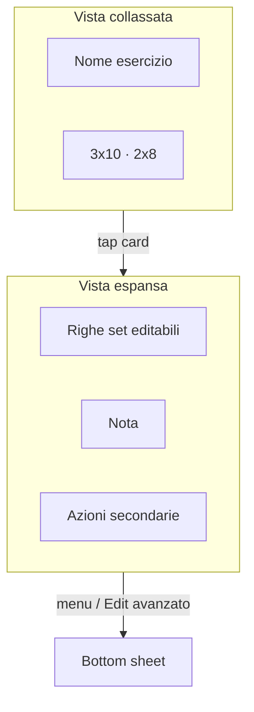

# Redesign UI Workout Builder (card + minimal)

## Direzione UI

- **Default collassato:** ogni blocco mostra solo l’essenziale (titolo + summary).
- **Card ovunque:** superficie unificata via [`StitchCard`](lib/core/ui/widgets/stitch_card.dart) (o un thin wrapper feature `WorkoutSurfaceCard` se serve `InkWell`/padding diversi).
- **Sotto-menu in-place:** tap sulla card apre/chiude sezioni (set, note, azioni secondarie) invece di aprire subito uno sheet.
- **Sheet solo per flussi compositi:** aggiungi esercizio da libreria, rename settimana/giorno, export, editor superset avanzato.
- **Niente cambio modello dati:** solo presentation; controller/handlers restano.

## Scope (opzione 2 — builder intero)

| Area | Cosa cambia |
|------|-------------|
| Training list | Card espandibili; set inline quando aperti |
| Planner week/day | Chrome più compatto / collassabile |
| Superset | Card gruppo + figli espandibili nella stessa lingua |
| Add exercise | Sheet unico a sezioni (pick → prescribe → note) |
| Mobilità | Stesse card + reorder invariato |
| Dettagli | Campi raggruppati in card/sezioni |

Fuori scope: autosave/trust UX, drag-reorder training, two-pane desktop editor, redesign app bar/export.

## Branch

Da `main`: `feat/workout-builder-ui-cards`.

---

## 1. Primitiva card espandibile

Creare [`lib/features/workouts/presentation/widgets/workout_expandable_card.dart`](lib/features/workouts/presentation/widgets/workout_expandable_card.dart):

- Header (titolo, summary, trailing menu/chevron)
- `expanded` + `onExpandedChanged`
- Body slot per contenuto secondario
- Stile: `StitchCard` / token `StitchM3Theme` (radiusLg, outline, surface)

Pattern di riferimento: expand/collapse in [`session_log_exercise_section.dart`](lib/features/workouts/presentation/widgets/session_log_exercise_section.dart).

---

## 2. Training — exercise cards

Rifattorire [`workout_exercise_card.dart`](lib/features/workouts/presentation/widgets/workout_exercise_card.dart):

- **Collapsed:** nome, summary set (`3x10 · 2x8`), indicatore link, `PopupMenuButton`
- **Expanded:** righe set (`WorkoutSetRepCell` / editor esistente), nota, CTA “aggiungi set”
- Tap card → toggle expand (non aprire subito lo sheet)
- “Modifica” nel menu → sheet attuale (`showEditExerciseDialog`) per shortName / prescriptionScope / edit completo
- Rimuovere l’obbligo di `compact: true` in [`workout_day_exercise_list.dart`](lib/features/workouts/presentation/widgets/workout_day_exercise_list.dart); stato expand gestito localmente (es. `Set<String> expandedIds` in un piccolo Stateful wrapper della lista, un solo esercizio espanso alla volta)

Aggiornare widget test in [`test/features/workouts/workout_builder_widgets_test.dart`](test/features/workouts/workout_builder_widgets_test.dart).

---

## 3. Planner week/day più minimale

In [`training_week_day_panel.dart`](lib/features/workouts/presentation/widgets/training_week_day_panel.dart) (+ chip rows):

- Raggruppare week/day/weekday in una **card planner** collassabile (“Settimana N · Giorno X · Lun”) che, aperta, mostra i selettori attuali
- Default: aperta se ≤1 settimana; altrimenti ricordare ultimo stato in memoria schermo (niente persistenza prefs in questa fase)
- Desktop: mantenere rail settimane; day pane allineato allo stesso linguaggio card
- Ridurre label uppercase / densità chips dove possibile senza cambiare callback handlers

---

## 4. Superset allineato

- [`workout_superset_panel.dart`](lib/features/workouts/presentation/widgets/workout_superset_panel.dart) / [`workout_superset_block.dart`](lib/features/workouts/presentation/widgets/workout_superset_block.dart): card gruppo con bordo accent, summary condiviso, figli come mini-row; tap gruppo → expand lista esercizi; “gestisci” → sheet esistente
- Stesso look delle exercise card (padding, radius, tipografia)

---

## 5. Add / edit exercise sheets

Semplificare gerarchia in `exercise_add_*`:

- Un flusso a **sezioni collassabili** dentro lo sheet: Libreria | Series | Note / advanced (load %)
- Compact one-tap resta entry rapida; full sheet riusa le stesse sezioni
- Non rompere save path in [`exercise_add_sheet_save_handler.dart`](lib/features/workouts/presentation/widgets/exercise_add_sheet_save_handler.dart)

---

## 6. Mobilità

- [`MobilityItemCard`](lib/features/workouts/presentation/widgets/workout_mobility_tab_widgets.dart) → `WorkoutExpandableCard`: collapsed = titolo + subtitle; expanded = shortTitle/edit fields o CTA edit
- Section chips: stile più pulito, azioni edit/delete solo nel menu overflow della sezione selezionata (meno icon clutter)
- Dashed add button invariato funzionalmente

---

## 7. Tab Dettagli

[`workout_plan_details_tab.dart`](lib/features/workouts/presentation/widgets/workout_plan_details_tab.dart):

- Raggruppare in 2–3 `StitchCard`: **Date & settimana**, **Metadati** (fase/tag/note), **Opzioni** (mobility toggle, completed/archived)
- Label + campi dentro le card; meno `ListTile` sparsi a pieno schermo

---

## 8. Shell / banners (light touch)

[`workout_builder_editor_shell.dart`](lib/features/workouts/presentation/widgets/workout_builder_editor_shell.dart):

- Padding/spacing più coerente tra name bar, tab, content
- Onboarding/first-save banners: lasciare comportamento; solo allineare bordo/radius alle card se banale

Niente cambio TabBar Training | Mobilità | Dettagli.

---

## Ordine di implementazione

1. `WorkoutExpandableCard` + refactor `WorkoutExerciseCard` + list expand state  
2. Planner collassabile  
3. Superset panel  
4. Mobility cards  
5. Details tab cards  
6. Add-exercise sheet sections  
7. Analyze + widget tests + QA manuale training/mobility/details

## Verifica

- `flutter analyze`
- `flutter test test/features/workouts/`
- QA: expand/collapse exercise, edit set inline, menu → sheet, superset expand, mobility reorder, details save metadata, add exercise compact + full

## Rischi

- Stato expand locale si resetta al rebuild della lista: tenere keys stabili su `exercise.id`
- Callback set già presenti sulla card non-compact: riusarli, non duplicare logica handlers
- Non toccare Drift / routine model
