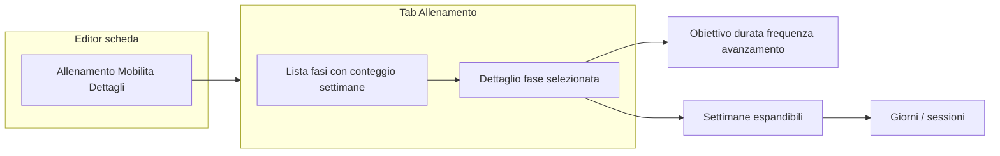
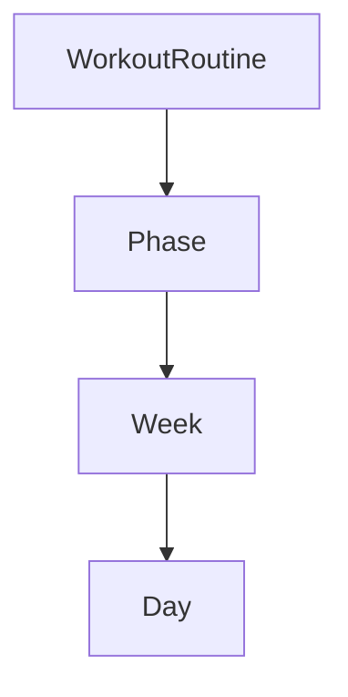

# Feature 49 — Fasi strutturali nel piano (Allenamento)

## Decisioni chiuse

- **Naming:** preset suggeriti (Massa, Definizione, Volume, Picco, Accumulo, Intensificazione, Deload, …) + custom.
- **UI:** allineata a Stitch — **lista fasi** + **dettaglio fase** con settimane annidate (scelta utente **2B**, raffinata dal mock).
- **Migrazione:** `weeks` legacy → una fase default **General** (label l10n in UI).
- **`WorkoutPlanApiModel.phase`:** resta metadata Dettagli; non è il nodo strutturale.

## Anteprima Stitch (source of truth UI)

| | |
|--|--|
| **Progetto** | [UI Pianificazione Allenamento a Fasi](https://stitch.withgoogle.com) — ID `14496212854931615246` |
| **Screen** | Editor Scheda - Gestione Fasi e Settimane — ID `1ce9870f70e04966a9e7108dd8b5e43c` |
| **Asset locali** | [`design/stitch-assets/phase-planning-ui/`](../design/stitch-assets/phase-planning-ui/) — `editor-fasi-settimane.png` + `.html` |

### Screenshot


### Layout target (da HTML Stitch)



Elementi obbligatori dal mock:

1. **Rail / lista fasi** — es. «Fase 1 · Accumulo & Volume · 4 Settimane»; azioni **Aggiungi Fase**, **Duplica Fase**, **Impostazioni Fase**.
2. **Header fase** — nome + meta: obiettivo (free text), durata derivata (`N` settimane), frequenza derivata (sessioni/settimana tipiche), avanzamento % **derivato** da `sessionCompletionByKey` sulle settimane della fase (non persistito).
3. **Corpo** — settimane collassabili (es. «Settimana 1 · Focus…»); dentro: giorni/sessioni come oggi (card esercizio, RPE, serie).
4. Empty state (riferimento precedente `w1` / assenza fasi): messaggio + **Aggiungi Fase** (non «Nuova settimana» come prima azione).

**Fuori MVP rispetto al mock Stitch:** tab «Progressione & Carichi»; editing carichi inline nel mock; numeri serie/RPE già coperti dal builder attuale — riusare componenti esistenti sotto la settimana.

## Modello target



In [`workout_routine_model.dart`](../lib/features/workouts/data/workout_routine_model.dart):

```dart
class Phase {
  final String id;
  final String name;
  final String? objective; // Stitch «Obiettivo» / Impostazioni Fase
  final List<Week> weeks;
}
```

`WorkoutRoutine.weeks` → `WorkoutRoutine.phases`.

Helper: `flattenWeeks()`, `globalWeekIndex(phaseIndex, weekInPhase)` per calendar / session keys / PDF / gym (minimo churn).

## Codec

[`workout_routine_json_codec.dart`](../lib/features/workouts/domain/workout_routine_json_codec.dart):

- Encode `phases: [{ id, name, objective?, weeks }]`
- Decode dual-read: `phases` oppure wrap legacy `weeks` in fase default
- Nessuna Drift migration

## Preset

[`workout_phase_presets.dart`](../lib/features/workouts/domain/workout_phase_presets.dart) + sheet «Aggiungi Fase»: chip preset (Accumulo, Intensificazione, Picco, Deload, Massa, Definizione, …) + «Personalizzata…».

## UI implementazione

File principali:

- [`workout_training_tab.dart`](../lib/features/workouts/presentation/widgets/workout_training_tab.dart) — layout rail + detail (wide) / stack (narrow)
- [`training_session_toolbar.dart`](../lib/features/workouts/presentation/widgets/training_session_toolbar.dart) / [`training_week_day_panel.dart`](../lib/features/workouts/presentation/widgets/training_week_day_panel.dart) — nested sotto fase
- Nuovi widget feature-scoped: es. `training_phase_rail.dart`, `training_phase_detail_header.dart`
- Handlers: [`workout_builder_training_handlers.dart`](../lib/features/workouts/presentation/workout_builder_training_handlers.dart)
- Mutations: [`workout_routine_mutations.dart`](../lib/features/workouts/domain/workout_routine_mutations.dart)

Session: `selectedPhaseIndex` + `selectedWeekInPhase`.

## Downstream + test

Wizard/presets → 1 fase + settimane; diff per fase; export/calendar/gym via `flattenWeeks()`.

Test: codec legacy/round-trip; CRUD fase; widget smoke lista fasi + empty «Aggiungi Fase».

## Fuori scope

- Tab Progressione & Carichi (Stitch)
- Auto-date fase → calendario
- Rimuovere metadata `WorkoutPlanApiModel.phase`
- Alternative esercizio (feature separata)

## Branch

`feat/workout-plan-phases` da `main`.
