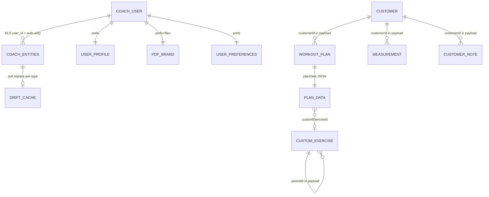
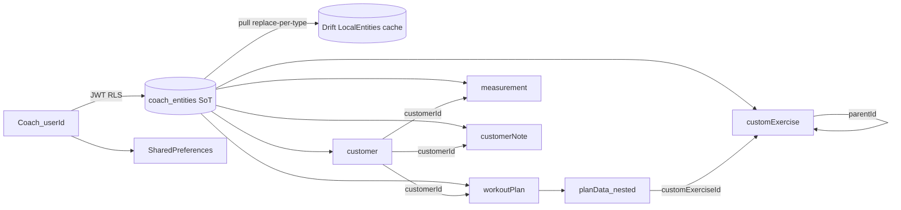

# Data catalog (cloud SoT)

Source of truth for **catalog metadata**: Dart registry
[`lib/core/data_catalog/data_catalog_registry.dart`](../lib/core/data_catalog/data_catalog_registry.dart).

Source of truth for **coach business data**: Supabase
`public.coach_entities` (JSONB document table). Drift `LocalEntities` is a
**per-user cache** replaced per entity type on pull. SharedPreferences stay
local (settings, drafts, pins, PDF brand).

OpenMetadata (optional local spike under `tool/openmetadata/`) ingests a JSON
dump of this registry. It does **not** replace the in-repo catalog.

Related: [sync-strategy.md](sync-strategy.md) (cloud SoT, online writes, pull,
one-shot migration).

## Storage model

| Locus | Mechanism | Role | Examples |
|-------|-----------|------|----------|
| Supabase `public.coach_entities` | `(user_id, type, id)` + `payload` JSONB | **Cloud SoT** | customer, workoutPlan, measurement, customExercise, customerNote |
| Drift `LocalEntities` | same logical row, local SQLite | **Cache** (full replace per type on pull) | same five types |
| Nested JSON | string field inside another payload | Embedded | `workoutPlan.planData` |
| SharedPreferences | per-user / global keys | Local-only | userProfile, pdfBrand, preferences, drafts |
| Filesystem | logo bytes under app documents (native) | Local-only | pdfBrand logo |

There are **no SQL foreign keys**. Relationships are soft string ids inside
JSON `payload` (and nested `planData`). Soft-delete uses the `deleted` column
(not hard DELETE from the app write path).

## `coach_entities` table

Migration: [`supabase/migrations/20261003200000_coach_entities.sql`](../supabase/migrations/20261003200000_coach_entities.sql).

| Column | Type | Notes |
|--------|------|-------|
| `user_id` | `uuid` | FK → `auth.users`; RLS key |
| `type` | `text` | CHECK — see below |
| `id` | `text` | Entity id |
| `scope_id` | `text` | e.g. coach userId, customerId, or `library` |
| `payload` | `jsonb` | Full entity JSON; soft FKs live here |
| `updated_at` | `timestamptz` | UTC |
| `deleted` | `boolean` | Soft-delete flag |

**Primary key:** `(user_id, type, id)`.

**`type` CHECK** (must match `OfflineEntityType.name`):

- `customer`
- `workoutPlan`
- `measurement`
- `customExercise`
- `customerNote`

Legacy `exerciseRecord` was removed from Drift (schema v3) and is **not** in
the CHECK list.

**Indexes:**

- `coach_entities_user_type_idx` — `(user_id, type)`
- `coach_entities_user_updated_at_idx` — `(user_id, updated_at desc)`
- `coach_entities_user_payload_customer_id_idx` — `(user_id, (payload->>'customerId'))` where `payload ? 'customerId'`

**RLS:** authenticated only; each policy requires `user_id = auth.uid()`.
`anon` has no grants. The app uses `SUPABASE_ANON_KEY` + user JWT — never a
service role for entity CRUD. Rehearsal: `supabase/tests/coach_entities_rls.sql`.

Shared Dart contract:
[`CoachEntityRowContract`](../lib/core/data_catalog/coach_entity_row_contract.dart).

## Data flows

| Flow | Behavior |
|------|----------|
| Online write | Authenticated session → remote upsert/soft-delete → then update Drift cache |
| Pull | On login / resume: list remote rows → **replace Drift rows per type** (includes soft-deleted) |
| One-shot migration | If remote empty and local/backup has entities → upload upsert → prefs `coach_entities_migration_v1_<userId>` |
| Prefs | Still SharedPreferences only (not Postgres) |
| Backup | File / Storage snapshots remain disaster recovery; restore writes remote + cache |

Details: [sync-strategy.md](sync-strategy.md).

## Entity relationship (soft FKs)





## Entity types (`OfflineEntityType` / `coach_entities.type`)

| Type | scope_id | Soft refs (in payload) | Backup |
|------|----------|------------------------|--------|
| `customer` | coach `userId` | — | `entities[]` |
| `workoutPlan` | `customerId` | `customerId` → customer | `entities[]` |
| `measurement` | `customerId` | `customerId` → customer | `entities[]` |
| `customExercise` | `"library"` | `parentId` → customExercise | `entities[]` |
| `customerNote` | `customerId` | `customerId` → customer | `entities[]` |

Each catalog entry documents:

- `locus`: `supabaseCoachEntities` (SoT)
- `cacheLocus`: `driftLocalEntities`
- `remoteTable` / `remoteRowFields` / `softDelete` / `rlsNote` / `softFkNote`

## Nested: `planData`

Nested JSON object (Map) on `workoutPlan.planData` (legacy JSON strings remain
readable). Codec: `lib/features/workouts/domain/workout_routine_json_codec.dart`.

- Structure: phases/weeks → days → exercises; mobility; `sessionExecutions`
- Soft refs: `customExerciseId` on mobility items, exercises, and executed logs
- Plan-level markers (`archivedAt`, `completedAt`, `startDate`, `endDate`,
  `currentWeek`) are **top-level** `workoutPlan` payload fields; readers still
  fall back to legacy nested keys inside `planData` when top-level is absent

## Non-cloud buckets (SharedPreferences)

| Catalog id | Locus | Backup key | Notes |
|------------|-------|------------|-------|
| `userProfile` | SharedPreferences | `localUserProfile` | Coach profile |
| `pdfBrand` | SharedPreferences + files | *(none)* | PDF brand kit; device-local |
| `userPreferences` | SharedPreferences | `preferences` | Settings + pins/recents |
| `workoutDraft` | SharedPreferences | *(none)* | Builder draft |
| `cloudBackupMeta` | SharedPreferences | *(none)* | Snapshot / sync timestamps |

## Dump registry JSON

```bash
dart run tool/dump_data_catalog.dart
# optional write:
dart run tool/dump_data_catalog.dart --out tool/openmetadata/fixtures/registry.json
```

Export format: `powercoach_data_catalog_v2` (includes top-level `coachEntities`
contract + per-entry cloud/cache fields).

## OpenMetadata spike (optional, local only)

Local ops scripts: `tool/openmetadata/scripts/{up,health,ingest,dq_to_om,profiler,down}.sh`
(see [`tool/openmetadata/README.md`](../tool/openmetadata/README.md) for sample data,
DQ bridge, and optional Postgres profiler). OM is a
viewer only; this document + the Dart registry remain authoritative. The spike
models a logical catalog that mirrors cloud SoT + prefs buckets. Not used in
CI; never expose the default `admin@open-metadata.org`/`admin` stack publicly.

## Data quality

Read-only scanner: `lib/core/data_quality/` (driven by registry soft refs).

In addition to entity soft-FKs and nested `planData` exercise ids, the scanner
checks backup `preferences` pin/recent lists
(`pinned_exercise_ids_json_v1`, `recent_exercise_ids_json_v1`) for orphan
refs to missing `customExercise` ids (report-only; malformed list values emit
`preferences_decode`).

```bash
# Fixture / unit tests
flutter test test/core/data_quality/

# Report on a backup file (JSON or Markdown)
dart run tool/data_quality_report.dart path/to/backup.json
dart run tool/data_quality_report.dart path/to/backup.json --format markdown
```

Findings are report-only — no auto-delete or repair. Run after pulls when
investigating integrity issues.
