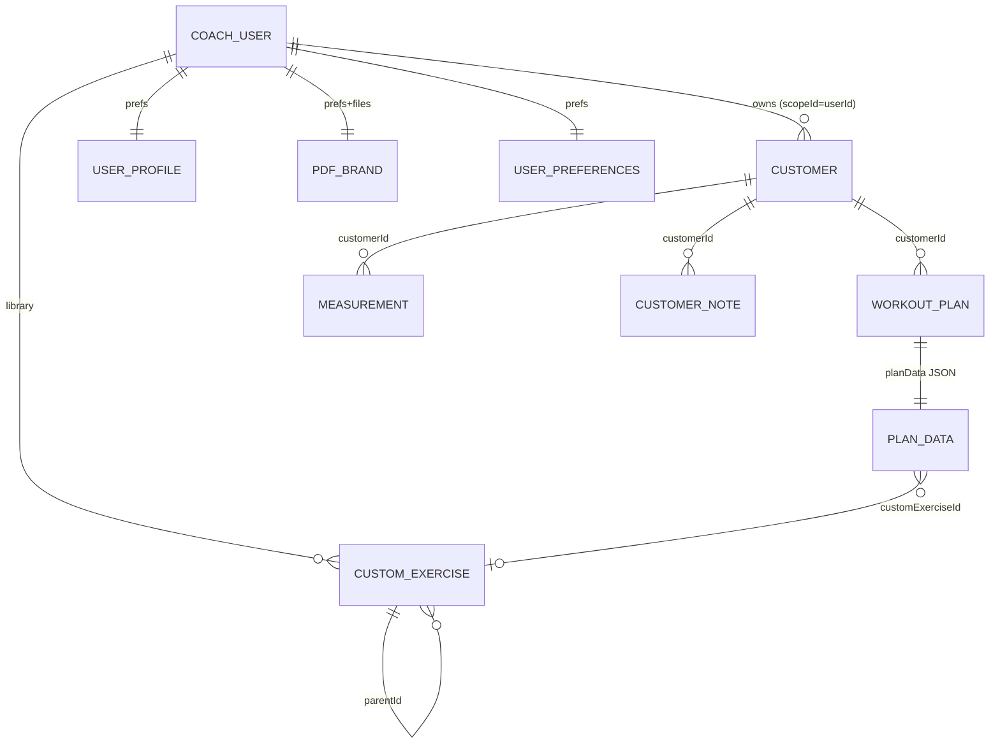
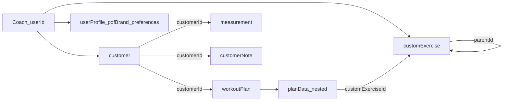

# Data catalog (local-first)

Source of truth: Dart registry
[`lib/core/data_catalog/data_catalog_registry.dart`](../lib/core/data_catalog/data_catalog_registry.dart).

OpenMetadata (optional local spike under `tool/openmetadata/`) ingests a JSON dump
of this registry. It does **not** replace the in-repo catalog.

Related: [sync-strategy.md](sync-strategy.md) (local-first + backup path).

## Storage model

| Locus | Mechanism | Examples |
|-------|-----------|----------|
| Drift `LocalEntities` | `(userId, type, id)` + `payloadJson` | customer, workoutPlan, measurement, customExercise, customerNote |
| Nested JSON | string field inside another payload | `workoutPlan.planData` |
| SharedPreferences | per-user / global keys | userProfile, pdfBrand, preferences, drafts |
| Filesystem | logo bytes under app documents (native) | pdfBrand logo |

There are **no SQL foreign keys**. Relationships are soft string ids inside JSON.

## Entity relationship (soft FKs)





## Drift entity types (`OfflineEntityType`)

| Type | scopeId | Soft refs | Backup |
|------|---------|-----------|--------|
| `customer` | coach `userId` | — | `entities[]` |
| `workoutPlan` | `customerId` | `customerId` → customer | `entities[]` |
| `measurement` | `customerId` | `customerId` → customer | `entities[]` |
| `customExercise` | `"library"` | `parentId` → customExercise | `entities[]` |
| `customerNote` | `customerId` | `customerId` → customer | `entities[]` |

Legacy removed type: `exerciseRecord` (former index 3) — skipped on read/backup.

## Nested: `planData`

Embedded JSON string on `workoutPlan`. Codec:
`lib/features/workouts/domain/workout_routine_json_codec.dart`.

- Structure: phases/weeks → days → exercises; mobility; `sessionExecutions`
- Soft refs: `customExerciseId` on mobility items, exercises, and executed logs

## Non-Drift buckets

| Catalog id | Locus | Backup key | Notes |
|------------|-------|------------|-------|
| `userProfile` | SharedPreferences | `localUserProfile` | Coach profile |
| `pdfBrand` | SharedPreferences + files | *(none)* | PDF brand kit; device-local |
| `userPreferences` | SharedPreferences | `preferences` | Settings + pins/recents |
| `workoutDraft` | SharedPreferences | *(none)* | Builder draft |
| `cloudBackupMeta` | SharedPreferences | *(none)* | Snapshot / sync timestamps |

## Dump registry JSON

```bash
dart run tool/dump_data_catalog.dart
# optional write:
dart run tool/dump_data_catalog.dart --out tool/openmetadata/fixtures/registry.json
```

## OpenMetadata spike (optional, local only)

See [`tool/openmetadata/README.md`](../tool/openmetadata/README.md) for Docker
Compose start/stop and custom ingestion from the registry JSON. OM is a viewer;
this document + the Dart registry remain authoritative. Not used in CI.

## Data quality

Read-only scanner: `lib/core/data_quality/` (driven by registry soft refs).

In addition to entity soft-FKs and nested `planData` exercise ids, the scanner
checks backup `preferences` pin/recent lists
(`pinned_exercise_ids_json_v1`, `recent_exercise_ids_json_v1`) for orphan
refs to missing `customExercise` ids (report-only; malformed list values emit
`preferences_decode`).

```bash
# Fixture / unit tests
flutter test test/core/data_quality/

# Report on a backup file (JSON or Markdown)
dart run tool/data_quality_report.dart path/to/backup.json
dart run tool/data_quality_report.dart path/to/backup.json --format markdown
```

Findings are report-only — no auto-delete or repair.
